# ZT Event Gateway - Complete Architecture & Flow Documentation

## Table of Contents

1. [System Architecture Design Flow](#1-system-architecture-design-flow)
2. [Saga Component Design Flow](#2-saga-component-design-flow)
3. [SPIFFE/SPIRE Component Design Flow](#3-spiffespire-component-design-flow)
4. [SPIFFE/SPIRE Operational Flow](#4-spiffespire-operational-flow)
5. [Request to Publish/Subscribe Event Flow](#5-request-to-publishsubscribe-event-flow)
6. [Request to Publish/Subscribe Workload Verification Flow](#6-request-to-publishsubscribe-workload-verification-flow)

---

## 1. System Architecture Design Flow

### 1.1 Overall System Architecture

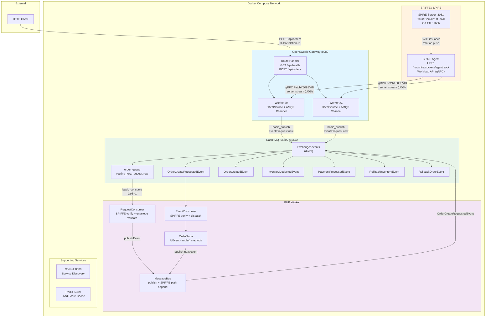
```mermaid
graph TB
    subgraph External["External"]
        Client["HTTP Client"]
    end

    subgraph Docker["Docker Compose Network"]
        subgraph Gateway["OpenSwoole Gateway :8080"]
            GW_W0["Worker #0<br/>X509Source + AMQP Channel"]
            GW_W1["Worker #1<br/>X509Source + AMQP Channel"]
            GW_Router["Route Handler<br/>GET /api/health<br/>POST /api/orders"]
        end

        subgraph MQ["RabbitMQ :5672 / :15672"]
            Exchange["Exchange: events<br/>(direct)"]
            Q_Order["order_queue<br/>routing_key: request.new"]
            Q_OCR["OrderCreateRequestedEvent"]
            Q_OC["OrderCreatedEvent"]
            Q_ID["InventoryDeductedEvent"]
            Q_PP["PaymentProcessedEvent"]
            Q_RI["RollbackInventoryEvent"]
            Q_RO["RollbackOrderEvent"]
        end

        subgraph Worker["PHP Worker"]
            ReqConsumer["RequestConsumer<br/>SPIFFE verify + envelope validate"]
            EvtConsumer["EventConsumer<br/>SPIFFE verify + dispatch"]
            Saga["OrderSaga<br/>#[EventHandler] methods"]
            MsgBus["MessageBus<br/>publish + SPIFFE path append"]
        end

        subgraph SPIRE["SPIFFE / SPIRE"]
            Server["SPIRE Server :8081<br/>Trust Domain: zt.local<br/>CA TTL: 168h"]
            Agent["SPIRE Agent<br/>UDS: /run/spire/sockets/agent.sock<br/>Workload API (gRPC)"]
        end

        subgraph Infra["Supporting Services"]
            Consul["Consul :8500<br/>Service Discovery"]
            Redis["Redis :6379<br/>Load Score Cache"]
        end
    end

    Client -->|"POST /api/orders<br/>X-Correlation-Id"| GW_Router
    GW_Router --> GW_W0
    GW_Router --> GW_W1
    GW_W0 -->|"basic_publish<br/>events:request.new"| Exchange
    GW_W1 -->|"basic_publish<br/>events:request.new"| Exchange
    Exchange --> Q_Order

    Q_Order -->|"basic_consume<br/>QoS=1"| ReqConsumer
    ReqConsumer -->|"publishEvent"| MsgBus
    MsgBus -->|"OrderCreateRequestedEvent"| Exchange
    Exchange --> Q_OCR
    Q_OCR --> EvtConsumer
    EvtConsumer --> Saga
    Saga -->|"publish next event"| MsgBus

    Exchange --> Q_OC
    Exchange --> Q_ID
    Exchange --> Q_PP
    Exchange --> Q_RI
    Exchange --> Q_RO

    Agent -->|"gRPC FetchX509SVID<br/>server stream (UDS)"| GW_W0
    Agent -->|"gRPC FetchX509SVID<br/>server stream (UDS)"| GW_W1
    Server -->|"SVID issuance<br/>rotation push"| Agent

    style Gateway fill:#e1f5fe
    style Worker fill:#f3e5f5
    style SPIRE fill:#fff3e0
    style MQ fill:#e8f5e9
```

### 1.2 Container & Network Topology

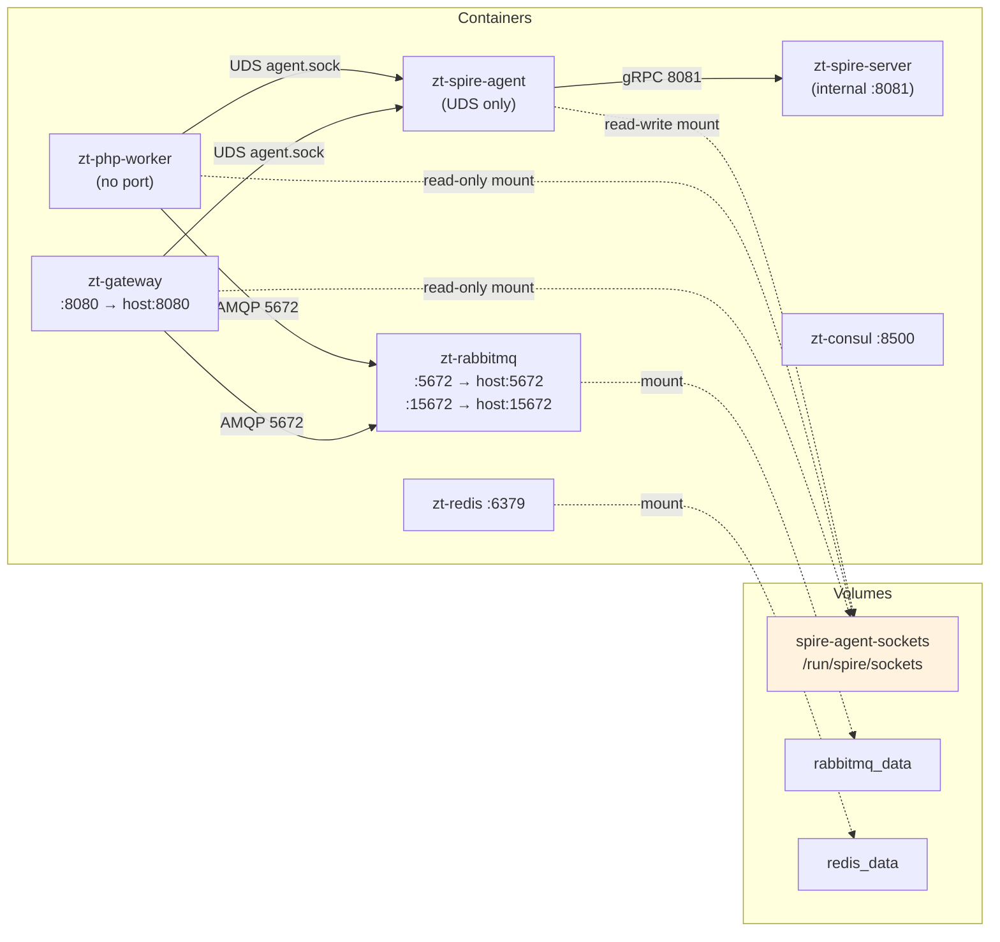
```mermaid
graph LR
    subgraph Volumes
        V1["spire-agent-sockets<br/>/run/spire/sockets"]
        V2["rabbitmq_data"]
        V3["redis_data"]
    end

    subgraph Containers
        C1["zt-gateway<br/>:8080 → host:8080"]
        C2["zt-php-worker<br/>(no port)"]
        C3["zt-rabbitmq<br/>:5672 → host:5672<br/>:15672 → host:15672"]
        C4["zt-spire-server<br/>(internal :8081)"]
        C5["zt-spire-agent<br/>(UDS only)"]
        C6["zt-consul :8500"]
        C7["zt-redis :6379"]
    end

    C1 -.->|"read-only mount"| V1
    C2 -.->|"read-only mount"| V1
    C5 -.->|"read-write mount"| V1
    C3 -.->|"mount"| V2
    C7 -.->|"mount"| V3

    C1 -->|"AMQP 5672"| C3
    C2 -->|"AMQP 5672"| C3
    C5 -->|"gRPC 8081"| C4
    C1 -->|"UDS agent.sock"| C5
    C2 -->|"UDS agent.sock"| C5

    style V1 fill:#fff3e0
```

### 1.3 Data Flow Pipeline

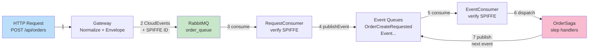
```mermaid
flowchart LR
    A["HTTP Request<br/>POST /api/orders"] -->|"1"| B["Gateway<br/>Normalize + Envelope"]
    B -->|"2 CloudEvents<br/>+ SPIFFE ID"| C["RabbitMQ<br/>order_queue"]
    C -->|"3 consume"| D["RequestConsumer<br/>verify SPIFFE"]
    D -->|"4 publishEvent"| E["Event Queues<br/>OrderCreateRequested<br/>Event..."]
    E -->|"5 consume"| F["EventConsumer<br/>verify SPIFFE"]
    F -->|"6 dispatch"| G["OrderSaga<br/>step handlers"]
    G -->|"7 publish<br/>next event"| E

    style A fill:#bbdefb
    style C fill:#c8e6c9
    style G fill:#f8bbd0
```

---

## 2. Saga Component Design Flow

### 2.1 Saga Class Hierarchy

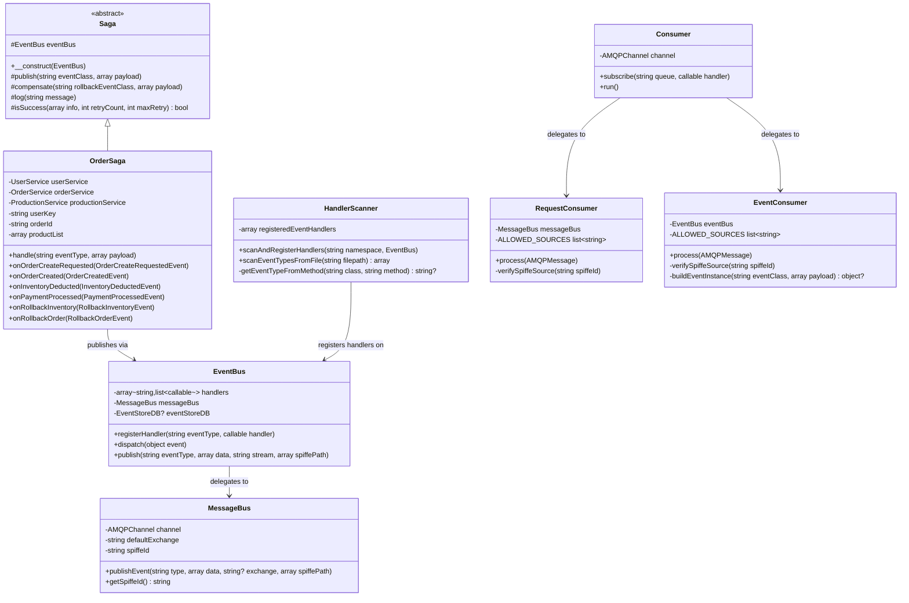
```mermaid
classDiagram
    class Saga {
        <<abstract>>
        #EventBus eventBus
        +__construct(EventBus)
        #publish(string eventClass, array payload)
        #compensate(string rollbackEventClass, array payload)
        #log(string message)
        #isSuccess(array info, int retryCount, int maxRetry) bool
    }

    class OrderSaga {
        -UserService userService
        -OrderService orderService
        -ProductionService productionService
        -string userKey
        -string orderId
        -array productList
        +handle(string eventType, array payload)
        +onOrderCreateRequested(OrderCreateRequestedEvent)
        +onOrderCreated(OrderCreatedEvent)
        +onInventoryDeducted(InventoryDeductedEvent)
        +onPaymentProcessed(PaymentProcessedEvent)
        +onRollbackInventory(RollbackInventoryEvent)
        +onRollbackOrder(RollbackOrderEvent)
    }

    class EventBus {
        -array~string,list~callable~~ handlers
        -MessageBus messageBus
        -EventStoreDB? eventStoreDB
        +registerHandler(string eventType, callable handler)
        +dispatch(object event)
        +publish(string eventType, array data, string stream, array spiffePath)
    }

    class MessageBus {
        -AMQPChannel channel
        -string defaultExchange
        -string spiffeId
        +publishEvent(string type, array data, string? exchange, array spiffePath)
        +getSpiffeId() string
    }

    class HandlerScanner {
        -array registeredEventHandlers
        +scanAndRegisterHandlers(string namespace, EventBus)
        +scanEventTypesFromFile(string filepath) array
        -getEventTypeFromMethod(string class, string method) string?
    }

    class Consumer {
        -AMQPChannel channel
        +subscribe(string queue, callable handler)
        +run()
    }

    Saga <|-- OrderSaga
    OrderSaga --> EventBus : publishes via
    EventBus --> MessageBus : delegates to
    HandlerScanner --> EventBus : registers handlers on
    Consumer --> RequestConsumer : delegates to
    Consumer --> EventConsumer : delegates to

    class RequestConsumer {
        -MessageBus messageBus
        -ALLOWED_SOURCES list~string~
        +process(AMQPMessage)
        -verifySpiffeSource(string spiffeId)
    }

    class EventConsumer {
        -EventBus eventBus
        -ALLOWED_SOURCES list~string~
        +process(AMQPMessage)
        -verifySpiffeSource(string spiffeId)
        -buildEventInstance(string eventClass, array payload) object?
    }
```

### 2.2 Saga Forward Path (Happy Path)

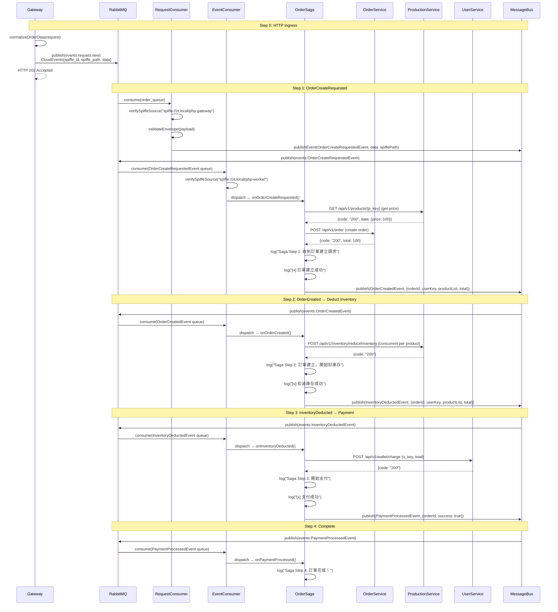
```mermaid
sequenceDiagram
    participant GW as Gateway
    participant MQ as RabbitMQ
    participant RC as RequestConsumer
    participant EC as EventConsumer
    participant S as OrderSaga
    participant OS as OrderService
    participant PS as ProductionService
    participant US as UserService
    participant MB as MessageBus

    Note over GW,MB: Step 0: HTTP Ingress
    GW->>GW: normalizeOrderData(request)
    GW->>MQ: publish(events:request.new)<br/>CloudEvents{spiffe_id, spiffe_path, data}
    GW-->>GW: HTTP 202 Accepted

    Note over MQ,MB: Step 1: OrderCreateRequested
    MQ->>RC: consume(order_queue)
    RC->>RC: verifySpiffeSource("spiffe://zt.local/php-gateway")
    RC->>RC: validateEnvelope(payload)
    RC->>MB: publishEvent(OrderCreateRequestedEvent, data, spiffePath)
    MB->>MQ: publish(events:OrderCreateRequestedEvent)

    MQ->>EC: consume(OrderCreateRequestedEvent queue)
    EC->>EC: verifySpiffeSource("spiffe://zt.local/php-worker")
    EC->>S: dispatch → onOrderCreateRequested()
    S->>PS: GET /api/v1/products/{p_key} (get price)
    PS-->>S: {code: "200", data: {price: 100}}
    S->>OS: POST /api/v1/order (create order)
    OS-->>S: {code: "200", total: 100}
    S->>S: log("Saga Step 1: 收到訂單建立請求")
    S->>S: log("[x] 訂單建立成功")
    S->>MB: publish(OrderCreatedEvent, {orderId, userKey, productList, total})

    Note over MQ,MB: Step 2: OrderCreated → Deduct Inventory
    MB->>MQ: publish(events:OrderCreatedEvent)
    MQ->>EC: consume(OrderCreatedEvent queue)
    EC->>S: dispatch → onOrderCreated()
    S->>PS: POST /api/v1/inventory/reduceInventory (concurrent per product)
    PS-->>S: {code: "200"}
    S->>S: log("Saga Step 2: 訂單建立，開始扣庫存")
    S->>S: log("[x] 扣減庫存成功")
    S->>MB: publish(InventoryDeductedEvent, {orderId, userKey, productList, total})

    Note over MQ,MB: Step 3: InventoryDeducted → Payment
    MB->>MQ: publish(events:InventoryDeductedEvent)
    MQ->>EC: consume(InventoryDeductedEvent queue)
    EC->>S: dispatch → onInventoryDeducted()
    S->>US: POST /api/v1/wallet/charge {o_key, total}
    US-->>S: {code: "200"}
    S->>S: log("Saga Step 3: 開始支付")
    S->>S: log("[x] 支付成功")
    S->>MB: publish(PaymentProcessedEvent, {orderId, success: true})

    Note over MQ,MB: Step 4: Complete
    MB->>MQ: publish(events:PaymentProcessedEvent)
    MQ->>EC: consume(PaymentProcessedEvent queue)
    EC->>S: dispatch → onPaymentProcessed()
    S->>S: log("Saga Step 4: 訂單完成！")
```

### 2.3 Saga Compensation Path (Payment Failure)

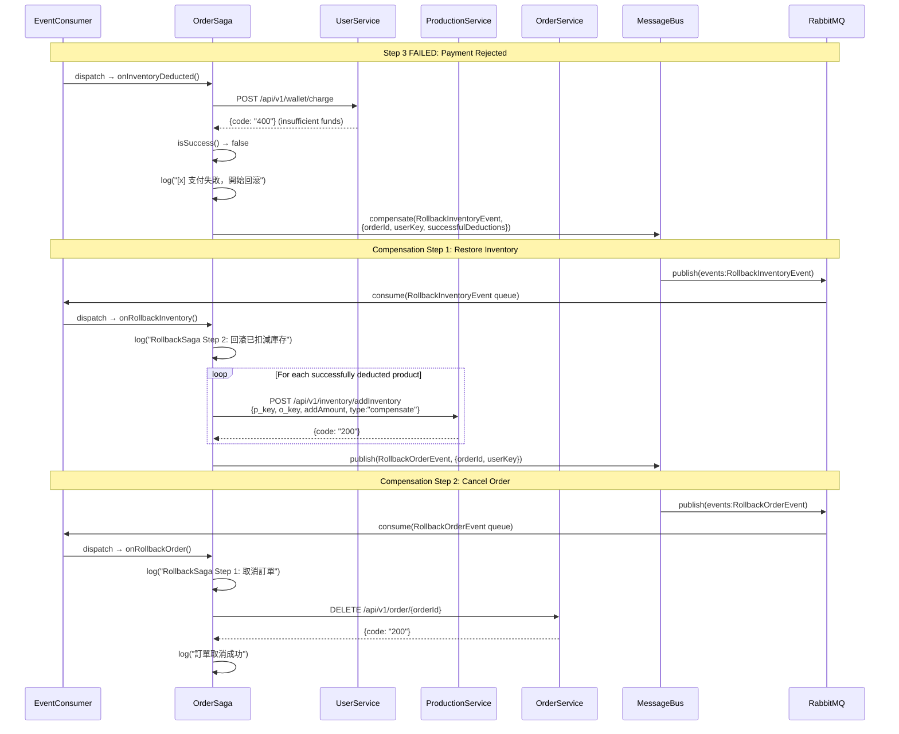
```mermaid
sequenceDiagram
    participant EC as EventConsumer
    participant S as OrderSaga
    participant US as UserService
    participant PS as ProductionService
    participant OS as OrderService
    participant MB as MessageBus
    participant MQ as RabbitMQ

    Note over EC,MQ: Step 3 FAILED: Payment Rejected
    EC->>S: dispatch → onInventoryDeducted()
    S->>US: POST /api/v1/wallet/charge
    US-->>S: {code: "400"} (insufficient funds)
    S->>S: isSuccess() → false
    S->>S: log("[x] 支付失敗，開始回滾")
    S->>MB: compensate(RollbackInventoryEvent,<br/>{orderId, userKey, successfulDeductions})

    Note over EC,MQ: Compensation Step 1: Restore Inventory
    MB->>MQ: publish(events:RollbackInventoryEvent)
    MQ->>EC: consume(RollbackInventoryEvent queue)
    EC->>S: dispatch → onRollbackInventory()
    S->>S: log("RollbackSaga Step 2: 回滾已扣減庫存")
    loop For each successfully deducted product
        S->>PS: POST /api/v1/inventory/addInventory<br/>{p_key, o_key, addAmount, type:"compensate"}
        PS-->>S: {code: "200"}
    end
    S->>MB: publish(RollbackOrderEvent, {orderId, userKey})

    Note over EC,MQ: Compensation Step 2: Cancel Order
    MB->>MQ: publish(events:RollbackOrderEvent)
    MQ->>EC: consume(RollbackOrderEvent queue)
    EC->>S: dispatch → onRollbackOrder()
    S->>S: log("RollbackSaga Step 1: 取消訂單")
    S->>OS: DELETE /api/v1/order/{orderId}
    OS-->>S: {code: "200"}
    S->>S: log("訂單取消成功")
```

### 2.4 Saga State Machine

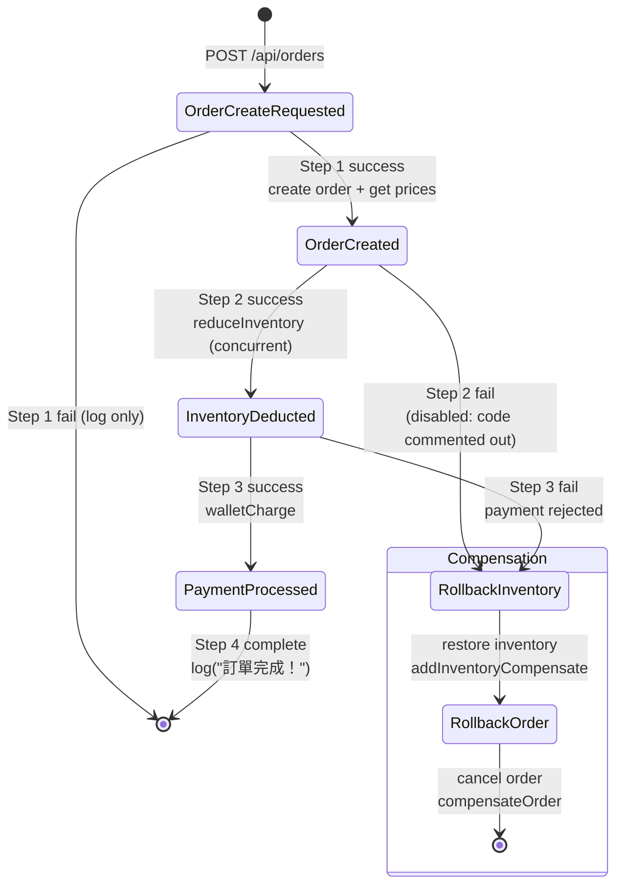
```mermaid
stateDiagram-v2
    [*] --> OrderCreateRequested: POST /api/orders
    
    OrderCreateRequested --> OrderCreated: Step 1 success<br/>create order + get prices
    OrderCreateRequested --> [*]: Step 1 fail (log only)
    
    OrderCreated --> InventoryDeducted: Step 2 success<br/>reduceInventory (concurrent)
    OrderCreated --> RollbackInventory: Step 2 fail<br/>(disabled: code commented out)
    
    InventoryDeducted --> PaymentProcessed: Step 3 success<br/>walletCharge
    InventoryDeducted --> RollbackInventory: Step 3 fail<br/>payment rejected
    
    PaymentProcessed --> [*]: Step 4 complete<br/>log("訂單完成！")
    
    state "Compensation" as comp {
        RollbackInventory --> RollbackOrder: restore inventory<br/>addInventoryCompensate
        RollbackOrder --> [*]: cancel order<br/>compensateOrder
    }
```

### 2.5 ACK / NACK / DROP Strategy

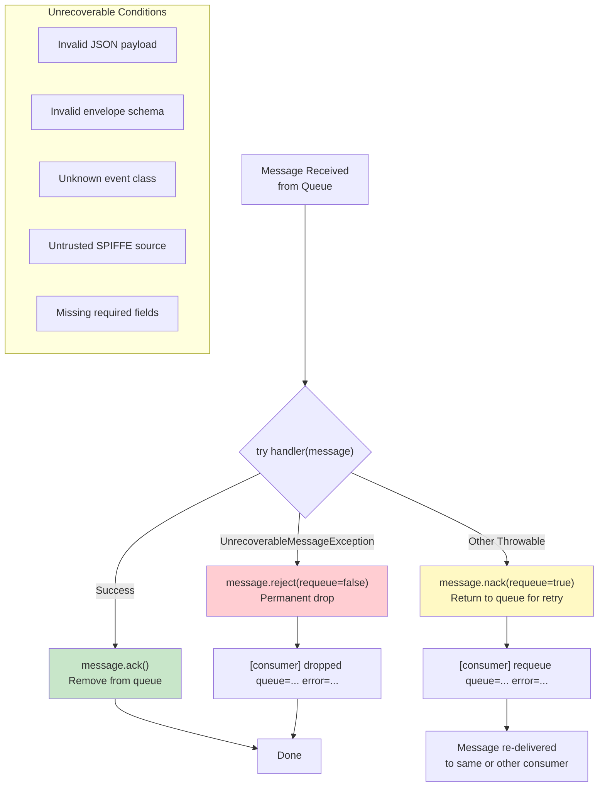
```mermaid
flowchart TD
    MSG["Message Received<br/>from Queue"] --> TRY{"try handler(message)"}
    
    TRY -->|"Success"| ACK["message.ack()<br/>Remove from queue"]
    TRY -->|"UnrecoverableMessageException"| DROP["message.reject(requeue=false)<br/>Permanent drop"]
    TRY -->|"Other Throwable"| NACK["message.nack(requeue=true)<br/>Return to queue for retry"]
    
    ACK --> DONE["Done"]
    DROP --> LOG_DROP["[consumer] dropped queue=... error=..."]
    NACK --> LOG_NACK["[consumer] requeue queue=... error=..."]
    
    LOG_DROP --> DONE
    LOG_NACK --> RETRY["Message re-delivered<br/>to same or other consumer"]

    subgraph "Unrecoverable Conditions"
        U1["Invalid JSON payload"]
        U2["Invalid envelope schema"]
        U3["Unknown event class"]
        U4["Untrusted SPIFFE source"]
        U5["Missing required fields"]
    end

    style ACK fill:#c8e6c9
    style DROP fill:#ffcdd2
    style NACK fill:#fff9c4
```

---

## 3. SPIFFE/SPIRE Component Design Flow

### 3.1 SPIFFE Component Architecture

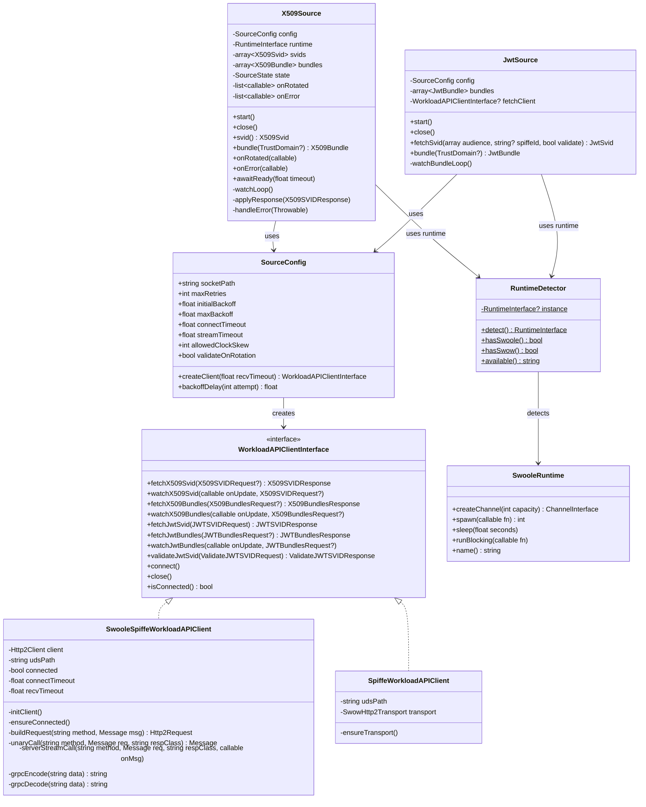
```mermaid
classDiagram
    class WorkloadAPIClientInterface {
        <<interface>>
        +fetchX509Svid(X509SVIDRequest?) X509SVIDResponse
        +watchX509Svid(callable onUpdate, X509SVIDRequest?)
        +fetchX509Bundles(X509BundlesRequest?) X509BundlesResponse
        +watchX509Bundles(callable onUpdate, X509BundlesRequest?)
        +fetchJwtSvid(JWTSVIDRequest) JWTSVIDResponse
        +fetchJwtBundles(JWTBundlesRequest?) JWTBundlesResponse
        +watchJwtBundles(callable onUpdate, JWTBundlesRequest?)
        +validateJwtSvid(ValidateJWTSVIDRequest) ValidateJWTSVIDResponse
        +connect()
        +close()
        +isConnected() bool
    }

    class SwooleSpiffeWorkloadAPIClient {
        -Http2Client client
        -string udsPath
        -bool connected
        -float connectTimeout
        -float recvTimeout
        -initClient()
        -ensureConnected()
        -buildRequest(string method, Message msg) Http2Request
        -unaryCall(string method, Message req, string respClass) Message
        -serverStreamCall(string method, Message req, string respClass, callable onMsg)
        -grpcEncode(string data) string
        -grpcDecode(string data) string
    }

    class SpiffeWorkloadAPIClient {
        -string udsPath
        -SwowHttp2Transport transport
        -ensureTransport()
    }

    class SourceConfig {
        +string socketPath
        +int maxRetries
        +float initialBackoff
        +float maxBackoff
        +float connectTimeout
        +float streamTimeout
        +int allowedClockSkew
        +bool validateOnRotation
        +createClient(float recvTimeout) WorkloadAPIClientInterface
        +backoffDelay(int attempt) float
    }

    class X509Source {
        -SourceConfig config
        -RuntimeInterface runtime
        -array~X509Svid~ svids
        -array~X509Bundle~ bundles
        -SourceState state
        -list~callable~ onRotated
        -list~callable~ onError
        +start()
        +close()
        +svid() X509Svid
        +bundle(TrustDomain?) X509Bundle
        +onRotated(callable)
        +onError(callable)
        +awaitReady(float timeout)
        -watchLoop()
        -applyResponse(X509SVIDResponse)
        -handleError(Throwable)
    }

    class JwtSource {
        -SourceConfig config
        -array~JwtBundle~ bundles
        -WorkloadAPIClientInterface? fetchClient
        +start()
        +close()
        +fetchSvid(array audience, string? spiffeId, bool validate) JwtSvid
        +bundle(TrustDomain?) JwtBundle
        -watchBundleLoop()
    }

    class RuntimeDetector {
        -RuntimeInterface? instance$
        +detect()$ RuntimeInterface
        +hasSwoole()$ bool
        +hasSwow()$ bool
        +available()$ string
    }

    class SwooleRuntime {
        +createChannel(int capacity) ChannelInterface
        +spawn(callable fn) int
        +sleep(float seconds)
        +runBlocking(callable fn)
        +name() string
    }

    WorkloadAPIClientInterface <|.. SwooleSpiffeWorkloadAPIClient
    WorkloadAPIClientInterface <|.. SpiffeWorkloadAPIClient
    SourceConfig --> WorkloadAPIClientInterface : creates
    X509Source --> SourceConfig : uses
    JwtSource --> SourceConfig : uses
    RuntimeDetector --> SwooleRuntime : detects
    X509Source --> RuntimeDetector : uses runtime
    JwtSource --> RuntimeDetector : uses runtime
```

### 3.2 SPIFFE Model Entities

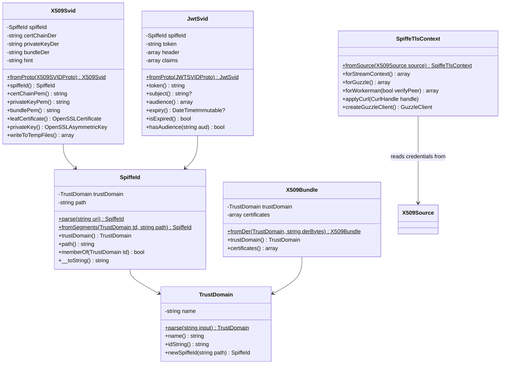
```mermaid
classDiagram
    class SpiffeId {
        -TrustDomain trustDomain
        -string path
        +parse(string uri)$ SpiffeId
        +fromSegments(TrustDomain td, string path)$ SpiffeId
        +trustDomain() TrustDomain
        +path() string
        +memberOf(TrustDomain td) bool
        +__toString() string
    }

    class TrustDomain {
        -string name
        +parse(string input)$ TrustDomain
        +name() string
        +idString() string
        +newSpiffeId(string path) SpiffeId
    }

    class X509Svid {
        -SpiffeId spiffeId
        -string certChainDer
        -string privateKeyDer
        -string bundleDer
        -string hint
        +fromProto(X509SVIDProto)$ X509Svid
        +spiffeId() SpiffeId
        +certChainPem() string
        +privateKeyPem() string
        +bundlePem() string
        +leafCertificate() OpenSSLCertificate
        +privateKey() OpenSSLAsymmetricKey
        +writeToTempFiles() array
    }

    class JwtSvid {
        -SpiffeId spiffeId
        -string token
        -array header
        -array claims
        +fromProto(JWTSVIDProto)$ JwtSvid
        +token() string
        +subject() string?
        +audience() array
        +expiry() DateTimeImmutable?
        +isExpired() bool
        +hasAudience(string aud) bool
    }

    class X509Bundle {
        -TrustDomain trustDomain
        -array certificates
        +fromDer(TrustDomain, string derBytes)$ X509Bundle
        +trustDomain() TrustDomain
        +certificates() array
    }

    class SpiffeTlsContext {
        +fromSource(X509Source source)$ SpiffeTlsContext
        +forStreamContext() array
        +forGuzzle() array
        +forWorkerman(bool verifyPeer) array
        +applyCurl(CurlHandle handle)
        +createGuzzleClient() GuzzleClient
    }

    SpiffeId --> TrustDomain
    X509Svid --> SpiffeId
    JwtSvid --> SpiffeId
    X509Bundle --> TrustDomain
    SpiffeTlsContext --> X509Source : reads credentials from
```

---

## 4. SPIFFE/SPIRE Operational Flow

### 4.1 SPIRE Bootstrap & Attestation

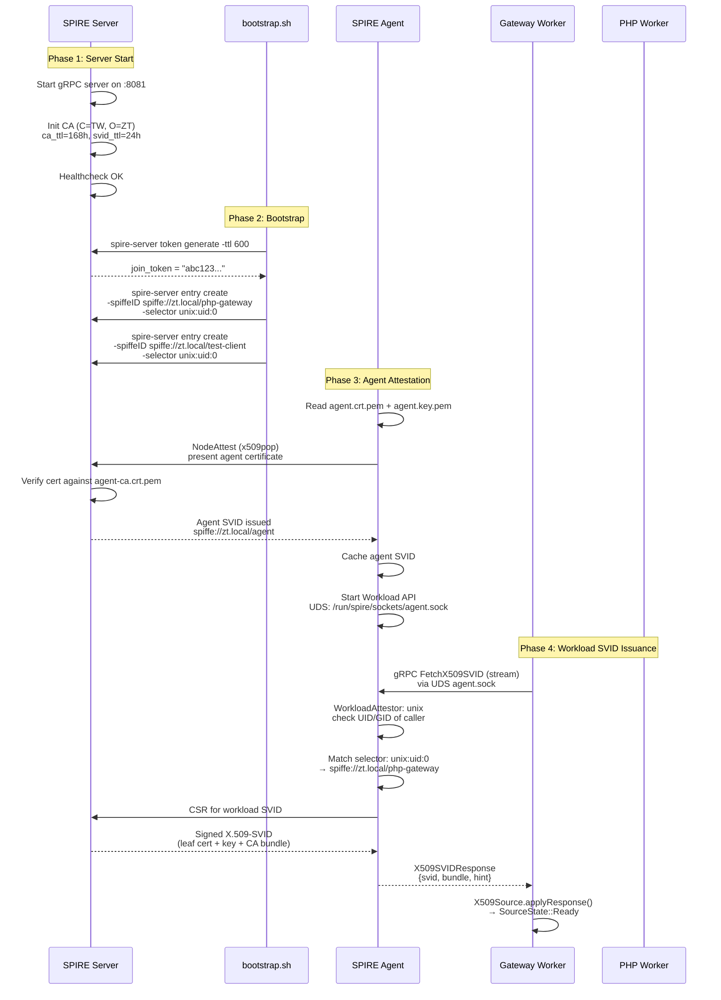
```mermaid
sequenceDiagram
    participant SS as SPIRE Server
    participant BS as bootstrap.sh
    participant SA as SPIRE Agent
    participant GW as Gateway Worker
    participant WK as PHP Worker

    Note over SS: Phase 1: Server Start
    SS->>SS: Start gRPC server on :8081
    SS->>SS: Init CA (C=TW, O=ZT)<br/>ca_ttl=168h, svid_ttl=24h
    SS->>SS: Healthcheck OK

    Note over BS: Phase 2: Bootstrap
    BS->>SS: spire-server token generate -ttl 600
    SS-->>BS: join_token = "abc123..."
    BS->>SS: spire-server entry create<br/>-spiffeID spiffe://zt.local/php-gateway<br/>-selector unix:uid:0
    BS->>SS: spire-server entry create<br/>-spiffeID spiffe://zt.local/test-client<br/>-selector unix:uid:0

    Note over SA: Phase 3: Agent Attestation
    SA->>SA: Read agent.crt.pem + agent.key.pem
    SA->>SS: NodeAttest (x509pop)<br/>present agent certificate
    SS->>SS: Verify cert against agent-ca.crt.pem
    SS-->>SA: Agent SVID issued<br/>spiffe://zt.local/agent
    SA->>SA: Cache agent SVID
    SA->>SA: Start Workload API<br/>UDS: /run/spire/sockets/agent.sock

    Note over GW,WK: Phase 4: Workload SVID Issuance
    GW->>SA: gRPC FetchX509SVID (stream)<br/>via UDS agent.sock
    SA->>SA: WorkloadAttestor: unix<br/>check UID/GID of caller
    SA->>SA: Match selector: unix:uid:0<br/>→ spiffe://zt.local/php-gateway
    SA->>SS: CSR for workload SVID
    SS-->>SA: Signed X.509-SVID<br/>(leaf cert + key + CA bundle)
    SA-->>GW: X509SVIDResponse<br/>{svid, bundle, hint}
    GW->>GW: X509Source.applyResponse()<br/>→ SourceState::Ready
```

### 4.2 X509Source State Machine & Rotation

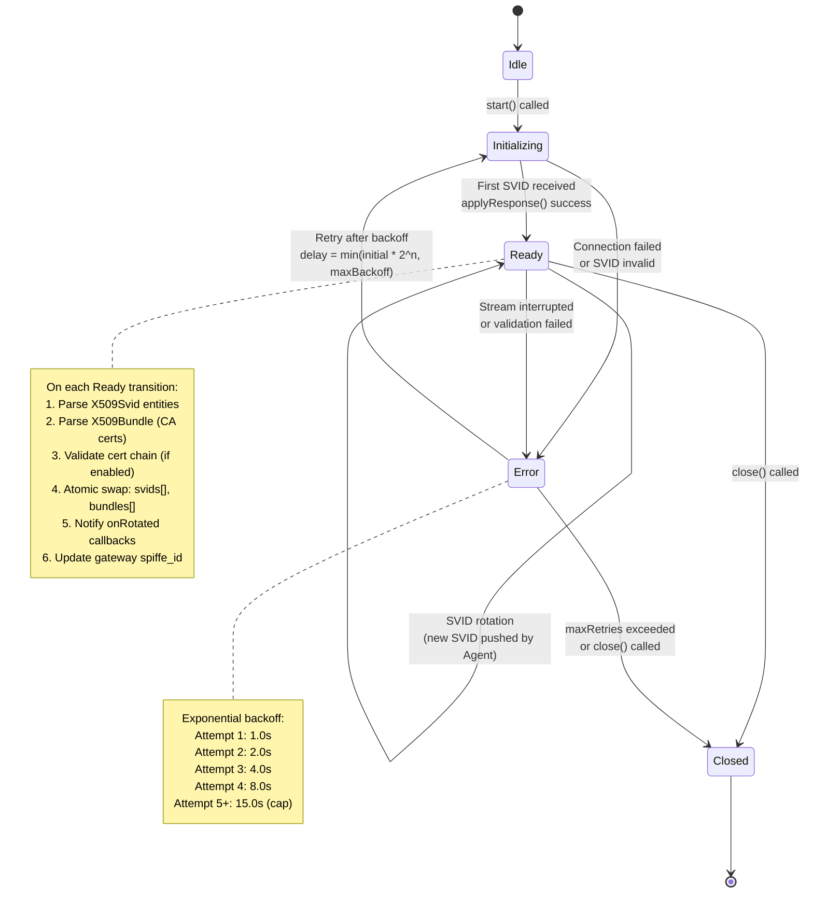
```mermaid
stateDiagram-v2
    [*] --> Idle

    Idle --> Initializing: start() called
    
    Initializing --> Ready: First SVID received<br/>applyResponse() success
    Initializing --> Error: Connection failed<br/>or SVID invalid

    Ready --> Ready: SVID rotation<br/>(new SVID pushed by Agent)
    Ready --> Error: Stream interrupted<br/>or validation failed
    Ready --> Closed: close() called

    Error --> Initializing: Retry after backoff<br/>delay = min(initial * 2^n, maxBackoff)
    Error --> Closed: maxRetries exceeded<br/>or close() called

    Closed --> [*]

    note right of Ready
        On each Ready transition:
        1. Parse X509Svid entities
        2. Parse X509Bundle (CA certs)
        3. Validate cert chain (if enabled)
        4. Atomic swap: svids[], bundles[]
        5. Notify onRotated callbacks
        6. Update gateway spiffe_id
    end note

    note right of Error
        Exponential backoff:
        Attempt 1: 1.0s
        Attempt 2: 2.0s
        Attempt 3: 4.0s
        Attempt 4: 8.0s
        Attempt 5+: 15.0s (cap)
    end note
```

### 4.3 gRPC Communication over UDS

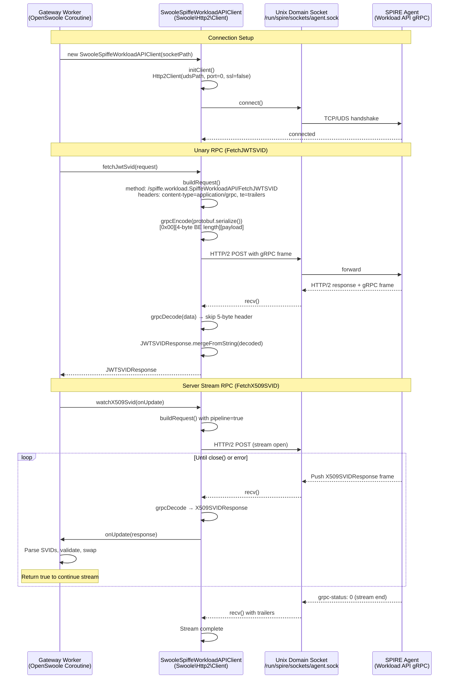
```mermaid
sequenceDiagram
    participant App as Gateway Worker<br/>(OpenSwoole Coroutine)
    participant Client as SwooleSpiffeWorkloadAPIClient<br/>(Swoole\Http2\Client)
    participant UDS as Unix Domain Socket<br/>/run/spire/sockets/agent.sock
    participant Agent as SPIRE Agent<br/>(Workload API gRPC)

    Note over App,Agent: Connection Setup
    App->>Client: new SwooleSpiffeWorkloadAPIClient(socketPath)
    Client->>Client: initClient()<br/>Http2Client(udsPath, port=0, ssl=false)
    Client->>UDS: connect()
    UDS->>Agent: TCP/UDS handshake
    Agent-->>Client: connected

    Note over App,Agent: Unary RPC (FetchJWTSVID)
    App->>Client: fetchJwtSvid(request)
    Client->>Client: buildRequest()<br/>method: /spiffe.workload.SpiffeWorkloadAPI/FetchJWTSVID<br/>headers: content-type=application/grpc, te=trailers
    Client->>Client: grpcEncode(protobuf.serialize())<br/>[0x00][4-byte BE length][payload]
    Client->>UDS: HTTP/2 POST with gRPC frame
    UDS->>Agent: forward
    Agent-->>UDS: HTTP/2 response + gRPC frame
    UDS-->>Client: recv()
    Client->>Client: grpcDecode(data) → skip 5-byte header
    Client->>Client: JWTSVIDResponse.mergeFromString(decoded)
    Client-->>App: JWTSVIDResponse

    Note over App,Agent: Server Stream RPC (FetchX509SVID)
    App->>Client: watchX509Svid(onUpdate)
    Client->>Client: buildRequest() with pipeline=true
    Client->>UDS: HTTP/2 POST (stream open)
    
    loop Until close() or error
        Agent-->>UDS: Push X509SVIDResponse frame
        UDS-->>Client: recv()
        Client->>Client: grpcDecode → X509SVIDResponse
        Client->>App: onUpdate(response)
        App->>App: Parse SVIDs, validate, swap
        Note over App: Return true to continue stream
    end

    Agent-->>UDS: grpc-status: 0 (stream end)
    UDS-->>Client: recv() with trailers
    Client->>Client: Stream complete
```

### 4.4 SVID Rotation & Credential Refresh

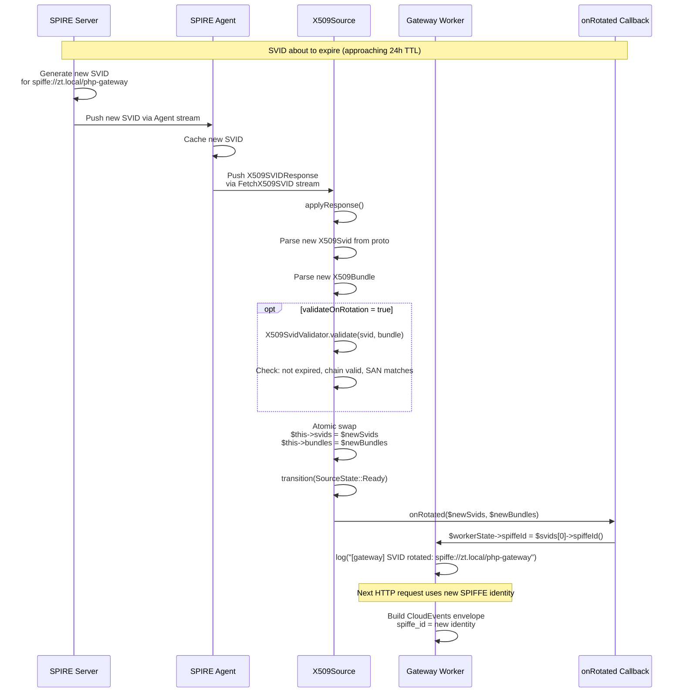
```mermaid
sequenceDiagram
    participant SS as SPIRE Server
    participant SA as SPIRE Agent
    participant X5 as X509Source
    participant GW as Gateway Worker
    participant CB as onRotated Callback

    Note over SS,CB: SVID about to expire (approaching 24h TTL)
    SS->>SS: Generate new SVID<br/>for spiffe://zt.local/php-gateway
    SS->>SA: Push new SVID via Agent stream
    SA->>SA: Cache new SVID
    SA->>X5: Push X509SVIDResponse<br/>via FetchX509SVID stream

    X5->>X5: applyResponse()
    X5->>X5: Parse new X509Svid from proto
    X5->>X5: Parse new X509Bundle
    
    opt validateOnRotation = true
        X5->>X5: X509SvidValidator.validate(svid, bundle)
        X5->>X5: Check: not expired, chain valid, SAN matches
    end

    X5->>X5: Atomic swap<br/>$this->svids = $newSvids<br/>$this->bundles = $newBundles
    X5->>X5: transition(SourceState::Ready)

    X5->>CB: onRotated($newSvids, $newBundles)
    CB->>GW: $workerState->spiffeId = $svids[0]->spiffeId()
    GW->>GW: log("[gateway] SVID rotated: spiffe://zt.local/php-gateway")

    Note over GW: Next HTTP request uses new SPIFFE identity
    GW->>GW: Build CloudEvents envelope<br/>spiffe_id = new identity
```

---

## 5. Request to Publish/Subscribe Event Flow

### 5.1 Complete Request-to-Event Pipeline

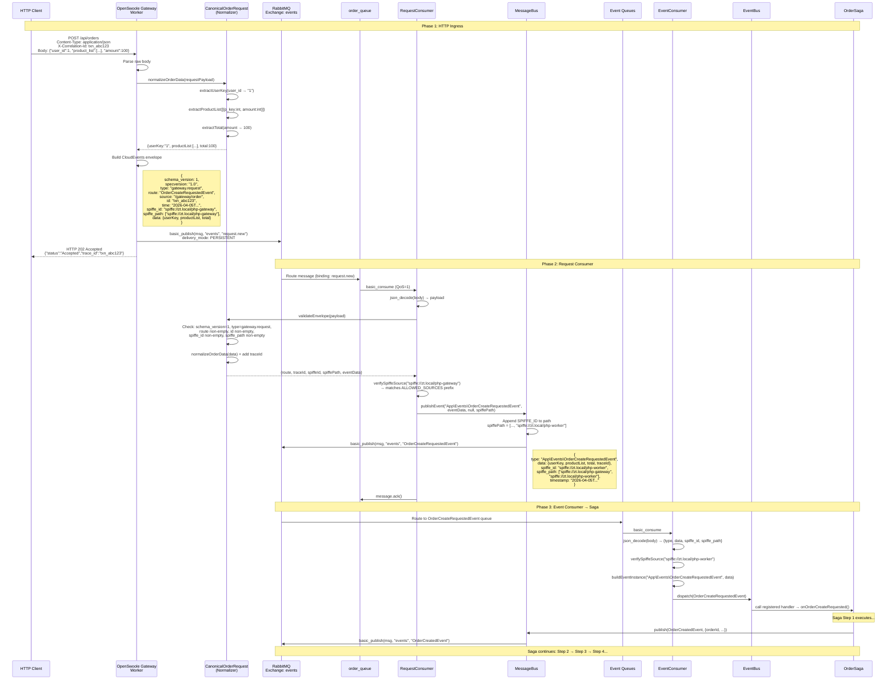
```mermaid
sequenceDiagram
    participant C as HTTP Client
    participant GW as OpenSwoole Gateway<br/>Worker #N
    participant N as CanonicalOrderRequest<br/>(Normalizer)
    participant MQ as RabbitMQ<br/>Exchange: events
    participant OQ as order_queue
    participant RC as RequestConsumer
    participant MB as MessageBus
    participant EQ as Event Queues
    participant EC as EventConsumer
    participant EB as EventBus
    participant OS as OrderSaga

    Note over C,OS: Phase 1: HTTP Ingress
    C->>GW: POST /api/orders<br/>Content-Type: application/json<br/>X-Correlation-Id: txn_abc123<br/>Body: {"user_id":1, "product_list":[...], "amount":100}
    
    GW->>GW: Parse raw body
    GW->>N: normalizeOrderData(requestPayload)
    N->>N: extractUserKey(user_id → "1")
    N->>N: extractProductList([{p_key:int, amount:int}])
    N->>N: extractTotal(amount → 100)
    N-->>GW: {userKey:"1", productList:[...], total:100}

    GW->>GW: Build CloudEvents envelope
    Note right of GW: {<br/>  schema_version: 1,<br/>  specversion: "1.0",<br/>  type: "gateway.request",<br/>  route: "OrderCreateRequestedEvent",<br/>  source: "/gateway/order",<br/>  id: "txn_abc123",<br/>  time: "2026-04-05T...",<br/>  spiffe_id: "spiffe://zt.local/php-gateway",<br/>  spiffe_path: ["spiffe://zt.local/php-gateway"],<br/>  data: {userKey, productList, total}<br/>}

    GW->>MQ: basic_publish(msg, "events", "request.new")<br/>delivery_mode: PERSISTENT
    GW-->>C: HTTP 202 Accepted<br/>{"status":"Accepted","trace_id":"txn_abc123"}

    Note over MQ,OS: Phase 2: Request Consumer
    MQ->>OQ: Route message (binding: request.new)
    OQ->>RC: basic_consume (QoS=1)
    RC->>RC: json_decode(body) → payload
    RC->>N: validateEnvelope(payload)
    N->>N: Check: schema_version=1, type=gateway.request,<br/>route non-empty, id non-empty,<br/>spiffe_id non-empty, spiffe_path non-empty
    N->>N: normalizeOrderData(data) + add traceId
    N-->>RC: {route, traceId, spiffeId, spiffePath, eventData}
    RC->>RC: verifySpiffeSource("spiffe://zt.local/php-gateway")<br/>→ matches ALLOWED_SOURCES prefix
    RC->>MB: publishEvent("App\Events\OrderCreateRequestedEvent",<br/>eventData, null, spiffePath)
    
    MB->>MB: Append SPIFFE_ID to path<br/>spiffePath = [..., "spiffe://zt.local/php-worker"]
    MB->>MQ: basic_publish(msg, "events", "OrderCreateRequestedEvent")
    Note right of MB: {<br/>  type: "App\Events\OrderCreateRequestedEvent",<br/>  data: {userKey, productList, total, traceId},<br/>  spiffe_id: "spiffe://zt.local/php-worker",<br/>  spiffe_path: ["spiffe://zt.local/php-gateway",<br/>               "spiffe://zt.local/php-worker"],<br/>  timestamp: "2026-04-05T..."<br/>}
    RC->>OQ: message.ack()

    Note over MQ,OS: Phase 3: Event Consumer → Saga
    MQ->>EQ: Route to OrderCreateRequestedEvent queue
    EQ->>EC: basic_consume
    EC->>EC: json_decode(body) → {type, data, spiffe_id, spiffe_path}
    EC->>EC: verifySpiffeSource("spiffe://zt.local/php-worker")
    EC->>EC: buildEventInstance("App\Events\OrderCreateRequestedEvent", data)
    EC->>EB: dispatch(OrderCreateRequestedEvent)
    EB->>OS: call registered handler → onOrderCreateRequested()

    Note over OS: Saga Step 1 executes...
    OS->>MB: publish(OrderCreatedEvent, {orderId, ...})
    MB->>MQ: basic_publish(msg, "events", "OrderCreatedEvent")
    Note over MQ,OS: Saga continues: Step 2 → Step 3 → Step 4...
```

### 5.2 Queue Topology & Routing

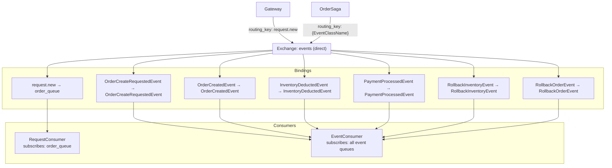
```mermaid
flowchart TB
    subgraph Exchange["Exchange: events (direct)"]
        direction TB
    end

    subgraph Bindings["Bindings"]
        B1["request.new → order_queue"]
        B2["OrderCreateRequestedEvent → OrderCreateRequestedEvent"]
        B3["OrderCreatedEvent → OrderCreatedEvent"]
        B4["InventoryDeductedEvent → InventoryDeductedEvent"]
        B5["PaymentProcessedEvent → PaymentProcessedEvent"]
        B6["RollbackInventoryEvent → RollbackInventoryEvent"]
        B7["RollbackOrderEvent → RollbackOrderEvent"]
    end

    subgraph Consumers
        RC["RequestConsumer<br/>subscribes: order_queue"]
        EC["EventConsumer<br/>subscribes: all event queues"]
    end

    GW["Gateway"] -->|"routing_key: request.new"| Exchange
    Saga["OrderSaga"] -->|"routing_key: {EventClassName}"| Exchange
    
    Exchange --> B1 --> RC
    Exchange --> B2 --> EC
    Exchange --> B3 --> EC
    Exchange --> B4 --> EC
    Exchange --> B5 --> EC
    Exchange --> B6 --> EC
    Exchange --> B7 --> EC
```

### 5.3 SPIFFE Identity Path Propagation (Per Hop)

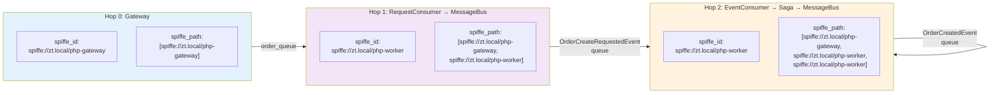
```mermaid
flowchart LR
    subgraph Hop0["Hop 0: Gateway"]
        G_ID["spiffe_id:<br/>spiffe://zt.local/php-gateway"]
        G_PATH["spiffe_path:<br/>[spiffe://zt.local/php-gateway]"]
    end

    subgraph Hop1["Hop 1: RequestConsumer → MessageBus"]
        H1_ID["spiffe_id:<br/>spiffe://zt.local/php-worker"]
        H1_PATH["spiffe_path:<br/>[spiffe://zt.local/php-gateway,<br/> spiffe://zt.local/php-worker]"]
    end

    subgraph Hop2["Hop 2: EventConsumer → Saga → MessageBus"]
        H2_ID["spiffe_id:<br/>spiffe://zt.local/php-worker"]
        H2_PATH["spiffe_path:<br/>[spiffe://zt.local/php-gateway,<br/> spiffe://zt.local/php-worker,<br/> spiffe://zt.local/php-worker]"]
    end

    Hop0 -->|"order_queue"| Hop1
    Hop1 -->|"OrderCreateRequestedEvent<br/>queue"| Hop2
    Hop2 -->|"OrderCreatedEvent<br/>queue"| Hop2

    style Hop0 fill:#e3f2fd
    style Hop1 fill:#f3e5f5
    style Hop2 fill:#fff3e0
```

---

## 6. Request to Publish/Subscribe Workload Verification Flow

### 6.1 Complete Workload Identity Verification Pipeline

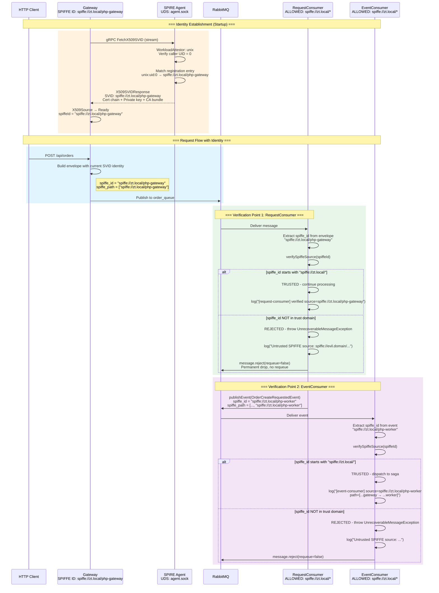
```mermaid
sequenceDiagram
    participant C as HTTP Client
    participant GW as Gateway<br/>SPIFFE ID: spiffe://zt.local/php-gateway
    participant SA as SPIRE Agent<br/>UDS: agent.sock
    participant MQ as RabbitMQ
    participant RC as RequestConsumer<br/>ALLOWED: spiffe://zt.local/*
    participant EC as EventConsumer<br/>ALLOWED: spiffe://zt.local/*

    Note over C,EC: === Identity Establishment (Startup) ===
    
    rect rgb(255, 243, 224)
        GW->>SA: gRPC FetchX509SVID (stream)
        SA->>SA: WorkloadAttestor: unix<br/>Verify caller UID = 0
        SA->>SA: Match registration entry<br/>unix:uid:0 → spiffe://zt.local/php-gateway
        SA-->>GW: X509SVIDResponse<br/>SVID: spiffe://zt.local/php-gateway<br/>Cert chain + Private key + CA bundle
        GW->>GW: X509Source → Ready<br/>spiffeId = "spiffe://zt.local/php-gateway"
    end

    Note over C,EC: === Request Flow with Identity ===
    
    rect rgb(225, 245, 254)
        C->>GW: POST /api/orders
        GW->>GW: Build envelope with current SVID identity
        Note right of GW: spiffe_id = "spiffe://zt.local/php-gateway"<br/>spiffe_path = ["spiffe://zt.local/php-gateway"]
        GW->>MQ: Publish to order_queue
    end

    rect rgb(232, 245, 233)
        Note over MQ,RC: === Verification Point 1: RequestConsumer ===
        MQ->>RC: Deliver message
        RC->>RC: Extract spiffe_id from envelope<br/>"spiffe://zt.local/php-gateway"
        RC->>RC: verifySpiffeSource(spiffeId)
        
        alt spiffe_id starts with "spiffe://zt.local/"
            RC->>RC: TRUSTED - continue processing
            RC->>RC: log("[request-consumer] verified source=spiffe://zt.local/php-gateway")
        else spiffe_id NOT in trust domain
            RC->>RC: REJECTED - throw UnrecoverableMessageException
            RC->>RC: log("Untrusted SPIFFE source: spiffe://evil.domain/...")
            RC->>MQ: message.reject(requeue=false)<br/>Permanent drop, no requeue
        end
    end

    rect rgb(243, 229, 245)
        Note over MQ,EC: === Verification Point 2: EventConsumer ===
        RC->>MQ: publishEvent(OrderCreateRequestedEvent)<br/>spiffe_id = "spiffe://zt.local/php-worker"<br/>spiffe_path = [..., "spiffe://zt.local/php-worker"]
        MQ->>EC: Deliver event
        EC->>EC: Extract spiffe_id from event<br/>"spiffe://zt.local/php-worker"
        EC->>EC: verifySpiffeSource(spiffeId)
        
        alt spiffe_id starts with "spiffe://zt.local/"
            EC->>EC: TRUSTED - dispatch to saga
            EC->>EC: log("[event-consumer] source=spiffe://zt.local/php-worker<br/>path=[...gateway → ...worker]")
        else spiffe_id NOT in trust domain
            EC->>EC: REJECTED - throw UnrecoverableMessageException
            EC->>EC: log("Untrusted SPIFFE source: ...")
            EC->>MQ: message.reject(requeue=false)
        end
    end
```

### 6.2 Untrusted Source Injection Attack & Defense

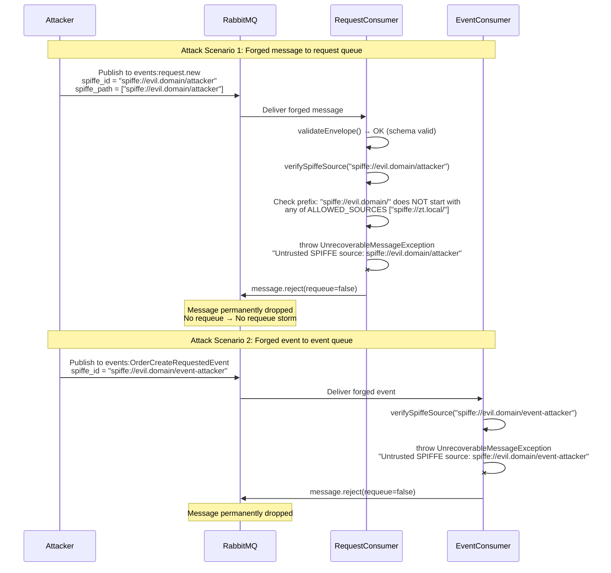
```mermaid
sequenceDiagram
    participant ATK as Attacker
    participant MQ as RabbitMQ
    participant RC as RequestConsumer
    participant EC as EventConsumer

    Note over ATK,EC: Attack Scenario 1: Forged message to request queue
    ATK->>MQ: Publish to events:request.new<br/>spiffe_id = "spiffe://evil.domain/attacker"<br/>spiffe_path = ["spiffe://evil.domain/attacker"]
    
    MQ->>RC: Deliver forged message
    RC->>RC: validateEnvelope() → OK (schema valid)
    RC->>RC: verifySpiffeSource("spiffe://evil.domain/attacker")
    RC->>RC: Check prefix: "spiffe://evil.domain/" does NOT start with<br/>any of ALLOWED_SOURCES ["spiffe://zt.local/"]
    
    RC-xRC: throw UnrecoverableMessageException<br/>"Untrusted SPIFFE source: spiffe://evil.domain/attacker"
    RC->>MQ: message.reject(requeue=false)
    Note over MQ: Message permanently dropped<br/>No requeue → No requeue storm

    Note over ATK,EC: Attack Scenario 2: Forged event to event queue
    ATK->>MQ: Publish to events:OrderCreateRequestedEvent<br/>spiffe_id = "spiffe://evil.domain/event-attacker"
    
    MQ->>EC: Deliver forged event
    EC->>EC: verifySpiffeSource("spiffe://evil.domain/event-attacker")
    EC-xEC: throw UnrecoverableMessageException<br/>"Untrusted SPIFFE source: spiffe://evil.domain/event-attacker"
    EC->>MQ: message.reject(requeue=false)
    Note over MQ: Message permanently dropped
```

### 6.3 End-to-End Identity Trust Chain

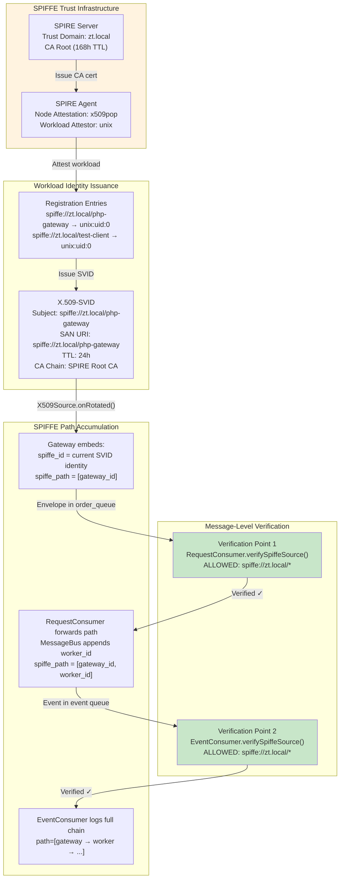
```mermaid
flowchart TB
    subgraph SPIRE["SPIFFE Trust Infrastructure"]
        SS["SPIRE Server<br/>Trust Domain: zt.local<br/>CA Root (168h TTL)"]
        SA["SPIRE Agent<br/>Node Attestation: x509pop<br/>Workload Attestor: unix"]
    end

    subgraph Identity["Workload Identity Issuance"]
        REG["Registration Entries<br/>spiffe://zt.local/php-gateway → unix:uid:0<br/>spiffe://zt.local/test-client → unix:uid:0"]
        SVID_GW["X.509-SVID<br/>Subject: spiffe://zt.local/php-gateway<br/>SAN URI: spiffe://zt.local/php-gateway<br/>TTL: 24h<br/>CA Chain: SPIRE Root CA"]
    end

    subgraph Verification["Message-Level Verification"]
        VP1["Verification Point 1<br/>RequestConsumer.verifySpiffeSource()<br/>ALLOWED: spiffe://zt.local/*"]
        VP2["Verification Point 2<br/>EventConsumer.verifySpiffeSource()<br/>ALLOWED: spiffe://zt.local/*"]
    end

    subgraph Propagation["SPIFFE Path Accumulation"]
        P0["Gateway embeds:<br/>spiffe_id = current SVID identity<br/>spiffe_path = [gateway_id]"]
        P1["RequestConsumer forwards path<br/>MessageBus appends worker_id<br/>spiffe_path = [gateway_id, worker_id]"]
        P2["EventConsumer logs full chain<br/>path=[gateway → worker → ...]"]
    end

    SS -->|"Issue CA cert"| SA
    SA -->|"Attest workload"| REG
    REG -->|"Issue SVID"| SVID_GW
    SVID_GW -->|"X509Source.onRotated()"| P0
    P0 -->|"Envelope in order_queue"| VP1
    VP1 -->|"Verified ✓"| P1
    P1 -->|"Event in event queue"| VP2
    VP2 -->|"Verified ✓"| P2

    style VP1 fill:#c8e6c9
    style VP2 fill:#c8e6c9
    style SPIRE fill:#fff3e0
```

### 6.4 Verification Decision Matrix

```mermaid
flowchart TD
    MSG["Incoming Message"] --> PARSE["Parse JSON payload"]
    
    PARSE -->|"Invalid JSON"| DROP1["DROP<br/>UnrecoverableMessageException<br/>'Invalid request payload'"]
    PARSE -->|"Valid JSON"| CHECK_TYPE{"Message on<br/>which queue?"}

    CHECK_TYPE -->|"order_queue"| RC_VALIDATE["RequestConsumer<br/>validateEnvelope()"]
    CHECK_TYPE -->|"event queue"| EC_VALIDATE["EventConsumer<br/>check type + data"]

    RC_VALIDATE -->|"schema_version != 1"| DROP2["DROP<br/>'Unsupported schema_version'"]
    RC_VALIDATE -->|"type != gateway.request"| DROP3["DROP<br/>'Invalid envelope type'"]
    RC_VALIDATE -->|"missing route/id/spiffe"| DROP4["DROP<br/>'Missing required field'"]
    RC_VALIDATE -->|"Valid envelope"| RC_SPIFFE["verifySpiffeSource()"]

    EC_VALIDATE -->|"missing type/data"| DROP5["DROP<br/>'Missing event type or data'"]
    EC_VALIDATE -->|"unknown class"| DROP6["DROP<br/>'Unknown event class'"]
    EC_VALIDATE -->|"Valid event"| EC_SPIFFE["verifySpiffeSource()"]

    RC_SPIFFE -->|"spiffe://zt.local/*"| RC_OK["PASS ✓<br/>Process + ACK"]
    RC_SPIFFE -->|"other domain"| DROP7["DROP<br/>'Untrusted SPIFFE source'"]

    EC_SPIFFE -->|"spiffe://zt.local/*"| EC_OK["PASS ✓<br/>Dispatch + ACK"]
    EC_SPIFFE -->|"other domain"| DROP8["DROP<br/>'Untrusted SPIFFE source'"]
    EC_SPIFFE -->|"empty spiffe_id"| EC_WARN["WARN<br/>log warning, continue dispatch"]

    style DROP1 fill:#ffcdd2
    style DROP2 fill:#ffcdd2
    style DROP3 fill:#ffcdd2
    style DROP4 fill:#ffcdd2
    style DROP5 fill:#ffcdd2
    style DROP6 fill:#ffcdd2
    style DROP7 fill:#ffcdd2
    style DROP8 fill:#ffcdd2
    style RC_OK fill:#c8e6c9
    style EC_OK fill:#c8e6c9
    style EC_WARN fill:#fff9c4
```

---

## Appendix: Key File Reference

| Component | File Path |
|-----------|-----------|
| Gateway Entry | `bin/gateway.php` |
| Worker Entry | `bin/worker.php` |
| Ingress Normalizer | `src/Ingress/CanonicalOrderRequest.php` |
| Request Consumer | `src/Worker/RequestConsumer.php` |
| Event Consumer | `src/Worker/EventConsumer.php` |
| Message Bus | `src/MessageQueue/MessageBus.php` |
| Transport Consumer | `src/MessageQueue/Consumer.php` |
| Event Bus | `src/EventBus.php` |
| Base Saga | `src/Saga.php` |
| Order Saga | `Sagas/OrderSaga.php` |
| Handler Scanner | `src/HandlerScanner.php` |
| Queue Topology | `src/QueueTopology.php` |
| X509Source | `src/Spiffe/Source/X509Source.php` |
| JwtSource | `src/Spiffe/Source/JwtSource.php` |
| Source Config | `src/Spiffe/Source/SourceConfig.php` |
| Swoole gRPC Client | `src/Spiffe/SwooleSpiffeWorkloadAPIClient.php` |
| Swow gRPC Client | `src/Spiffe/SpiffeWorkloadAPIClient.php` |
| Runtime Detector | `src/Spiffe/Runtime/RuntimeDetector.php` |
| TLS Context | `src/Spiffe/TLS/SpiffeTlsContext.php` |
| Peer Authorizer | `src/Spiffe/TLS/TlsPeerAuthorizer.php` |
| SPIFFE ID Model | `src/Spiffe/Model/SpiffeId.php` |
| X509 SVID Model | `src/Spiffe/Model/X509Svid.php` |
| JWT SVID Model | `src/Spiffe/Model/JwtSvid.php` |
| Docker Compose | `docker-compose.yml` |
| OpenSwoole Dockerfile | `docker/php-openswoole/Dockerfile` |
| E2E Test Script | `scripts/e2e-gateway.sh` |
| CI Verify Script | `scripts/ci-verify.sh` |
