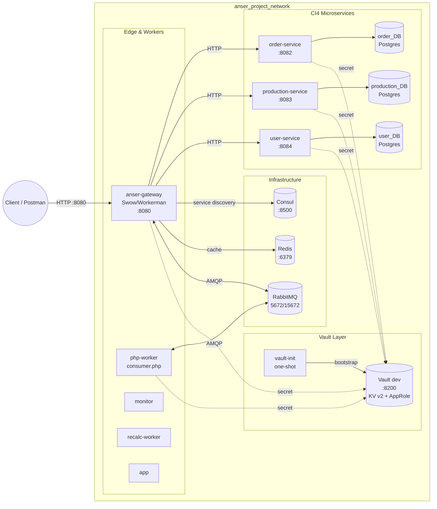
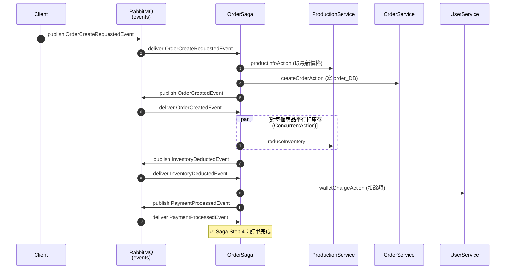
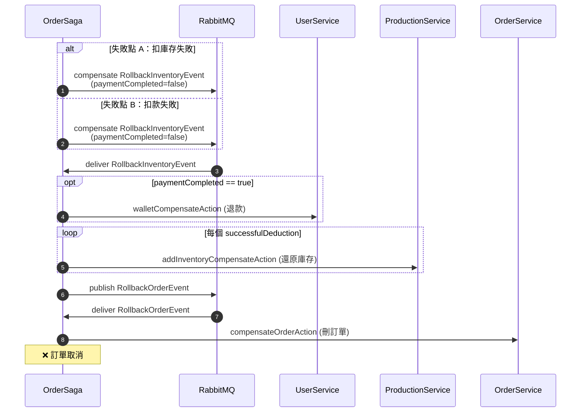
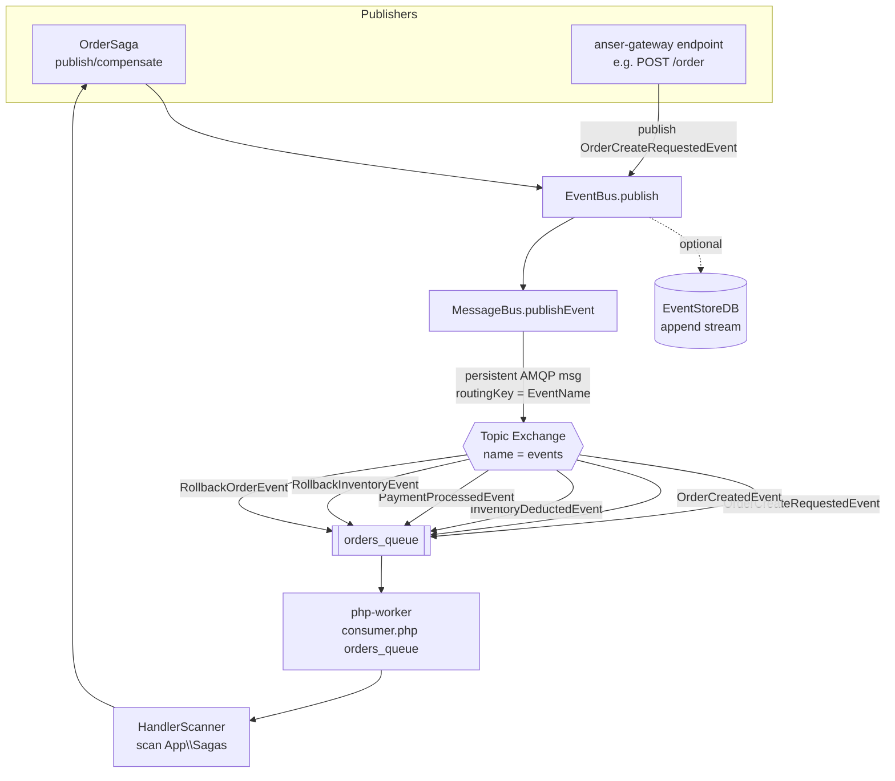
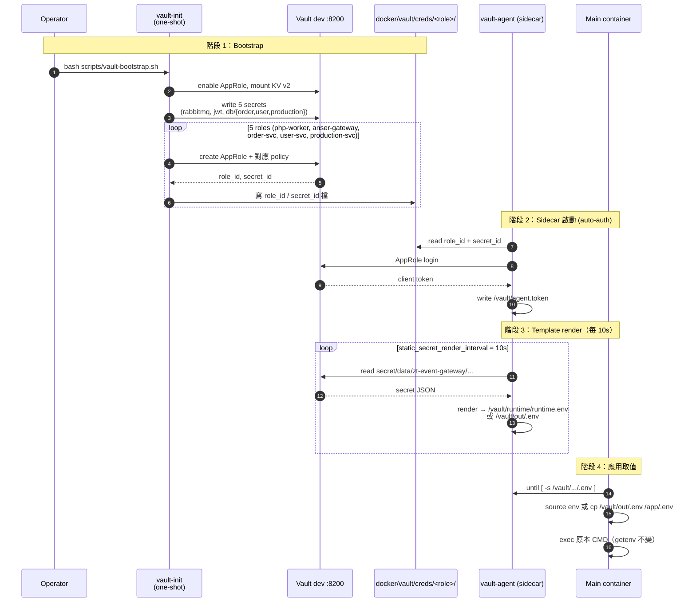

# zt-event-gateway 架構圖

本文件用 Mermaid 描繪 zt-event-gateway 的四個層次：**部署 / 業務流程 / 事件 / 安全**。
GitHub、VSCode preview、任何標準 Markdown 渲染器都可直接顯示。

對應已存在的補充資料：

- `docs/vault-integration.md` — Vault Runbook（旋轉、debug、完全重置）
- `Sagas/OrderSaga.php` — 訂單 Saga 主邏輯
- `src/EventBus.php`、`src/MessageQueue/MessageBus.php` — Event/Pub-Sub 機制

---

## 1. 系統部署架構

涵蓋根 `docker-compose.yml`（基礎設施 + Worker + Gateway + Vault sidecar 群）與三份
`Services/{Order,Production,User}_service/docker-compose.yml`（各自獨立 compose、各自
PostgreSQL）。所有容器透過 external network `anser_project_network` 互通。

| 元件 | Image / Framework | Port | 來源 |
| --- | --- | --- | --- |
| anser-gateway | Swow + Workerman (PHP) | 8080 | 根 `composer.json`、`docker-compose.yml` L198-296 |
| order-service / production-service / user-service | CodeIgniter 4 (PHP) | 8082 / 8083 / 8084 | `Services/*/docker-compose.yml` |
| RabbitMQ | `rabbitmq:3.13-management` | 5672 / 15672 | `docker-compose.yml` L3-19 |
| Consul | `hashicorp/consul:1.20` | 8500 | L21-31 |
| Redis | `redis:7-alpine` | 6379 | L33-44 |
| Vault | `hashicorp/vault:1.18` (dev) | 8200 | L50-73 |

> 三個 CI4 服務在獨立 compose project 中啟動，但都加入 `anser_project_network`
> （`networks: anser_project_network: { external: true }`），與主 stack 共用同一張網。

---

## 2. 訂單 Saga — Happy Path

依照 `Sagas/OrderSaga.php` L96-215 的 4 個事件 step。每一步都由 saga 從 RabbitMQ
queue 拿到事件後驅動，呼叫對應微服務 HTTP API，完成後再 publish 下一個事件。

| Step | 進入點 | 主邏輯 | 行號 |
| --- | --- | --- | --- |
| 1 | `onOrderCreateRequested` | 取價 → 建單 → publish `OrderCreatedEvent` | `Sagas/OrderSaga.php` L96-131 |
| 2 | `onOrderCreated` | 平行扣庫存 → publish `InventoryDeductedEvent` | L133-179 |
| 3 | `onInventoryDeducted` | 扣錢包 → publish `PaymentProcessedEvent` | L181-207 |
| 4 | `onPaymentProcessed` | 結束 | L209-215 |

---

## 3. 訂單 Saga — 補償流程

兩個失敗點：
- **A**（Step 2）：任一商品扣庫存失敗 → `compensate(RollbackInventoryEvent, paymentCompleted=false)`
- **B**（Step 3）：扣款失敗 → `compensate(RollbackInventoryEvent, paymentCompleted=false)`

> 目前程式 `paymentCompleted` 在補償時送 `false`（`OrderSaga.php` L166、L196），
> 但 `onRollbackInventory` 仍保留 `paymentCompleted=true` 分支以呼叫 `walletCompensateAction`，
> 供未來扣款已成立但下游失敗時退款使用。

| 補償 step | 進入點 | 行號 |
| --- | --- | --- |
| 還原庫存 / 退款 | `onRollbackInventory` | `Sagas/OrderSaga.php` L217-238 |
| 取消訂單 | `onRollbackOrder` | L241-254 |

---

## 4. 事件驅動 Pub-Sub 拓撲

`EventBus::publish()` 會做兩件事：（可選）寫入 EventStoreDB stream、再交由
`MessageBus::publishEvent()` 用 **AMQP topic exchange `events`** 廣播；routing key 取
event class 的 basename（`substr(strrchr($eventType, '\\'), 1)`）。

`consumer.php` 從 CLI 讀 queue 名（如 `orders_queue` 或 `request_queue`）後啟動消費者；
`HandlerScanner` 掃 `App\Sagas` namespace 自動把 `OrderSaga` 的 `#[EventHandler]` 註冊到
`EventBus`。

| 元件 | 檔案 | 重點行 |
| --- | --- | --- |
| Topic exchange / routing key | `src/MessageQueue/MessageBus.php` | L13-25、L47-57 |
| EventBus + EventStoreDB 旁路 | `src/EventBus.php` | L52-66 |
| Consumer 啟動 | `consumer.php` | L20-39 |
| Saga handler 註冊 | `consumer.php` L29-30 + `HandlerScanner` |

---

## 5. Vault 整合 + Secret 遞送時序

採 **AppRole + Vault Agent sidecar** 模式：`vault-init` 一次性建立 5 個 AppRole，把
`role_id` / `secret_id` 寫到 `docker/vault/creds/<role>/` bind mount；之後每個主容器
配對一個 sidecar，sidecar 用這對 creds 換 token、定期 render secret 成 env 檔，主
容器啟動時 source 該檔。**業務 PHP 程式碼完全不用改**。

| 角色 | Sidecar | 取得的 env | 模板 |
| --- | --- | --- | --- |
| `php-worker` | `vault-agent-php-worker` | `RABBITMQ_*`, `AMQP_*` | `docker/vault/templates/php-worker.env.tpl` |
| `anser-gateway` / `app` / `monitor` / `recalc-worker` | `vault-agent-anser-gateway` 等 | `RABBITMQ_*`, `AMQP_*`, `LOAD_BALANCE_AMQP_*` | `anser-gateway.env.tpl` |
| `order-service` | `vault-agent-order` | CI4 完整 `.env`（DB） | `order-ci4.env.tpl` |
| `user-service` | `vault-agent-user` | CI4 `.env` + `JWT_SECRET` | `user-ci4.env.tpl` |
| `production-service` | `vault-agent-production` | CI4 `.env` | `production-ci4.env.tpl` |

| 用途 | 檔案 |
| --- | --- |
| 一鍵 bootstrap | `scripts/vault-bootstrap.sh` |
| 寫 secret + AppRole | `docker/vault/scripts/init.sh` |
| Vault server config | `docker/vault/vault-server.hcl` |
| 每個角色的 agent 設定 | `docker/vault/agent/{php-worker,anser-gateway,order-svc,user-svc,production-svc}.hcl` |
| 每個角色的 policy | `docker/vault/policies/<role>.hcl` |
| Runbook（旋轉、debug） | `docs/vault-integration.md` |
