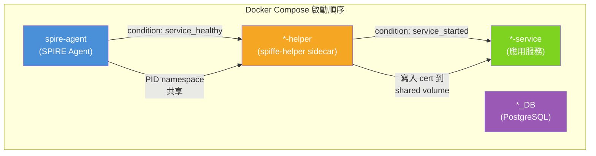
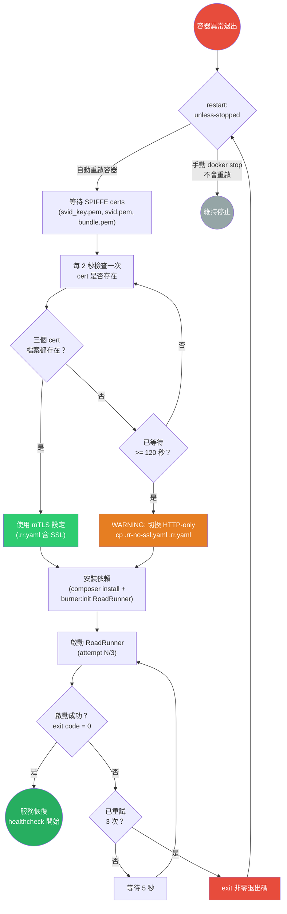
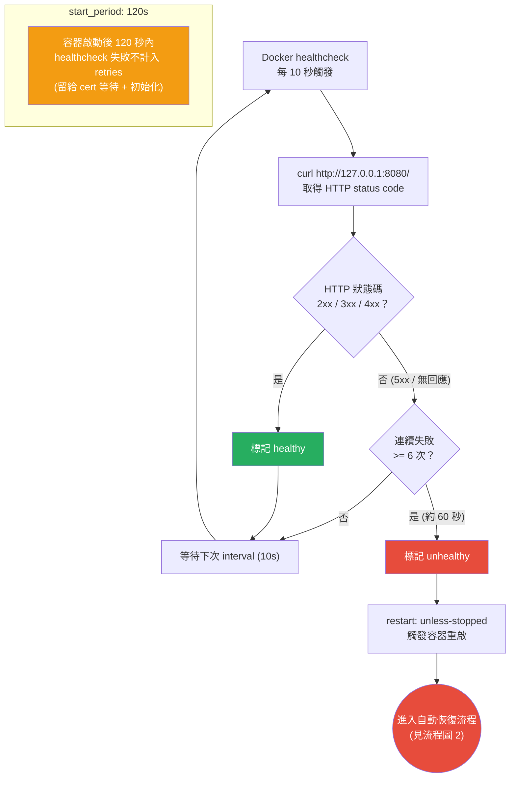
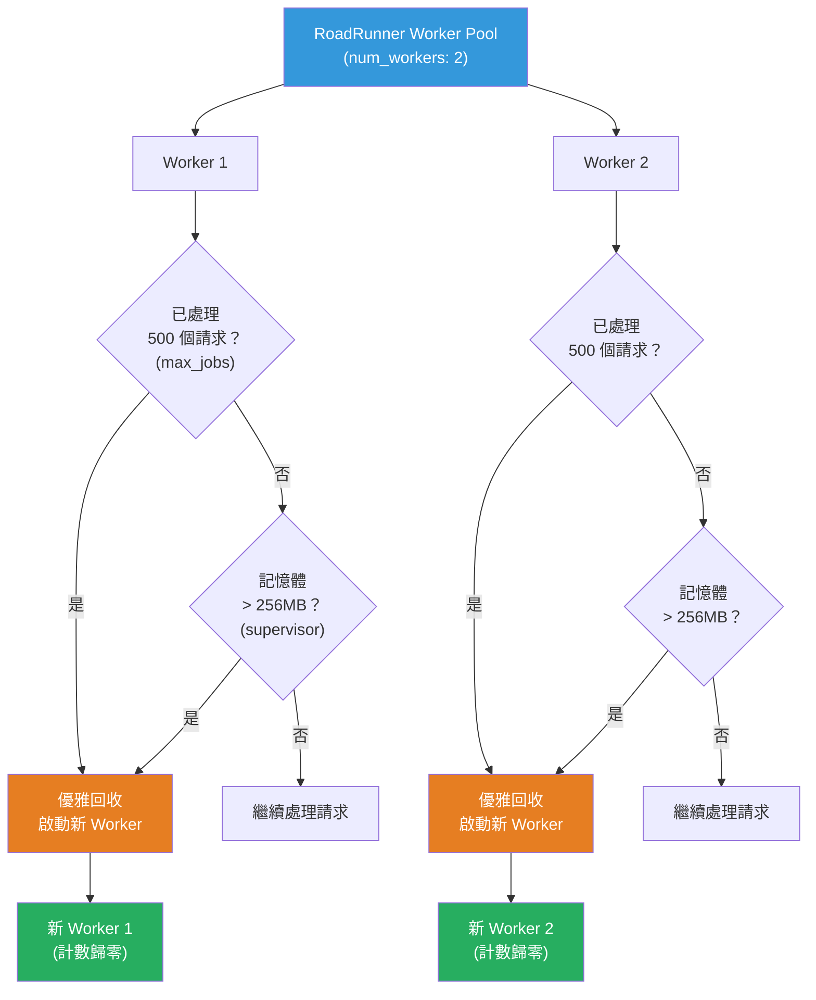
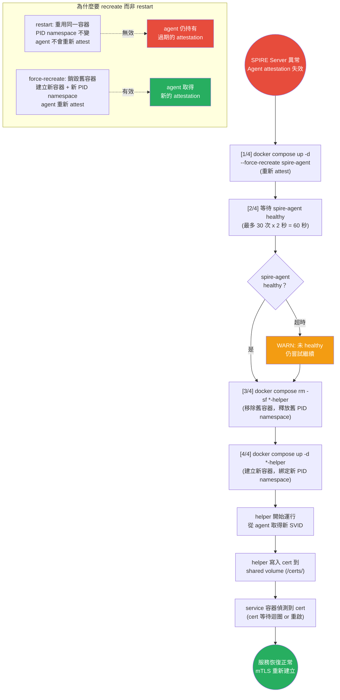
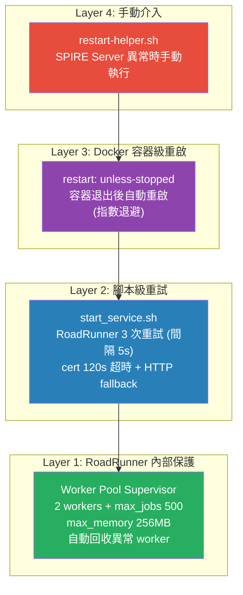

# 重啟機制流程圖

## 1. 容器啟動順序與依賴關係

```mermaid
graph TD
    subgraph "Docker Compose 啟動順序"
        A["spire-agent<br/>(SPIRE Agent)"] -->|"condition: service_healthy"| B["*-helper<br/>(spiffe-helper sidecar)"]
        B -->|"condition: service_started"| C["*-service<br/>(應用服務)"]
        D["*_DB<br/>(PostgreSQL)"]
    end

    A -- "PID namespace<br/>共享" --> B
    B -- "寫入 cert 到<br/>shared volume" --> C

    style A fill:#4a90d9,color:#fff
    style B fill:#f5a623,color:#fff
    style C fill:#7ed321,color:#fff
    style D fill:#9b59b6,color:#fff
```

## 2. 容器異常退出 — 自動恢復流程

```mermaid
flowchart TD
    START(("容器異常退出")) --> DOCKER_RESTART{"restart:<br/>unless-stopped"}

    DOCKER_RESTART -->|"自動重啟容器"| CERT_WAIT["等待 SPIFFE certs<br/>(svid_key.pem, svid.pem, bundle.pem)"]
    DOCKER_RESTART -->|"手動 docker stop<br/>不會重啟"| MANUAL_STOP(("維持停止"))

    CERT_WAIT --> POLL["每 2 秒檢查一次<br/>cert 是否存在"]
    POLL --> CERT_CHECK{"三個 cert<br/>檔案都存在？"}

    CERT_CHECK -->|"是"| MTLS_CONFIG["使用 mTLS 設定<br/>(.rr.yaml 含 SSL)"]
    CERT_CHECK -->|"否"| TIMEOUT_CHECK{"已等待<br/>>= 120 秒？"}

    TIMEOUT_CHECK -->|"否"| POLL
    TIMEOUT_CHECK -->|"是"| FALLBACK["WARNING: 切換 HTTP-only<br/>cp .rr-no-ssl.yaml .rr.yaml"]

    MTLS_CONFIG --> DEPS
    FALLBACK --> DEPS

    DEPS["安裝依賴<br/>(composer install +<br/>burner:init RoadRunner)"] --> RR_START

    RR_START["啟動 RoadRunner<br/>(attempt N/3)"] --> RR_CHECK{"啟動成功？<br/>exit code = 0"}

    RR_CHECK -->|"是"| HEALTHY(("服務恢復<br/>healthcheck 開始"))
    RR_CHECK -->|"否"| RETRY_CHECK{"已重試<br/>3 次？"}

    RETRY_CHECK -->|"否"| WAIT_5S["等待 5 秒"] --> RR_START
    RETRY_CHECK -->|"是"| EXIT_FAIL["exit 非零退出碼"]

    EXIT_FAIL --> DOCKER_RESTART

    style START fill:#e74c3c,color:#fff
    style HEALTHY fill:#27ae60,color:#fff
    style MANUAL_STOP fill:#95a5a6,color:#fff
    style FALLBACK fill:#e67e22,color:#fff
    style EXIT_FAIL fill:#e74c3c,color:#fff
    style MTLS_CONFIG fill:#2ecc71,color:#fff
```

## 3. Healthcheck 檢測流程

```mermaid
flowchart TD
    HC_START["Docker healthcheck<br/>每 10 秒觸發"] --> CURL["curl http://127.0.0.1:8080/<br/>取得 HTTP status code"]
    CURL --> HC_RESULT{"HTTP 狀態碼<br/>2xx / 3xx / 4xx？"}

    HC_RESULT -->|"是"| HC_HEALTHY["標記 healthy"]
    HC_RESULT -->|"否 (5xx / 無回應)"| HC_FAIL_COUNT{"連續失敗<br/>>= 6 次？"}

    HC_FAIL_COUNT -->|"否"| HC_WAIT["等待下次 interval (10s)"] --> HC_START
    HC_FAIL_COUNT -->|"是 (約 60 秒)"| HC_UNHEALTHY["標記 unhealthy"]

    HC_UNHEALTHY --> RESTART_POLICY["restart: unless-stopped<br/>觸發容器重啟"]
    RESTART_POLICY --> NEW_CYCLE(("進入自動恢復流程<br/>(見流程圖 2)"))

    HC_HEALTHY --> HC_WAIT

    subgraph "start_period: 120s"
        SP_NOTE["容器啟動後 120 秒內<br/>healthcheck 失敗不計入 retries<br/>(留給 cert 等待 + 初始化)"]
    end

    style HC_HEALTHY fill:#27ae60,color:#fff
    style HC_UNHEALTHY fill:#e74c3c,color:#fff
    style NEW_CYCLE fill:#e74c3c,color:#fff
    style SP_NOTE fill:#f39c12,color:#fff
```

## 4. RoadRunner Worker 池保護機制

```mermaid
flowchart TD
    POOL["RoadRunner Worker Pool<br/>(num_workers: 2)"] --> W1["Worker 1"]
    POOL --> W2["Worker 2"]

    W1 --> JOB_CHECK1{"已處理<br/>500 個請求？<br/>(max_jobs)"}
    JOB_CHECK1 -->|"是"| RECYCLE1["優雅回收<br/>啟動新 Worker"]
    JOB_CHECK1 -->|"否"| MEM_CHECK1{"記憶體<br/>> 256MB？<br/>(supervisor)"}
    MEM_CHECK1 -->|"是"| RECYCLE1
    MEM_CHECK1 -->|"否"| CONTINUE1["繼續處理請求"]

    W2 --> JOB_CHECK2{"已處理<br/>500 個請求？"}
    JOB_CHECK2 -->|"是"| RECYCLE2["優雅回收<br/>啟動新 Worker"]
    JOB_CHECK2 -->|"否"| MEM_CHECK2{"記憶體<br/>> 256MB？"}
    MEM_CHECK2 -->|"是"| RECYCLE2
    MEM_CHECK2 -->|"否"| CONTINUE2["繼續處理請求"]

    RECYCLE1 --> NEW1["新 Worker 1<br/>(計數歸零)"]
    RECYCLE2 --> NEW2["新 Worker 2<br/>(計數歸零)"]

    style POOL fill:#3498db,color:#fff
    style RECYCLE1 fill:#e67e22,color:#fff
    style RECYCLE2 fill:#e67e22,color:#fff
    style NEW1 fill:#27ae60,color:#fff
    style NEW2 fill:#27ae60,color:#fff
```

## 5. SPIRE Server 異常 — restart-helper.sh 手動恢復流程

```mermaid
flowchart TD
    TRIGGER(("SPIRE Server 異常<br/>Agent attestation 失效")) --> STEP1["[1/4] docker compose up -d<br/>--force-recreate spire-agent<br/>(重新 attest)"]

    STEP1 --> STEP2["[2/4] 等待 spire-agent healthy<br/>(最多 30 次 x 2 秒 = 60 秒)"]
    STEP2 --> AGENT_HC{"spire-agent<br/>healthy？"}

    AGENT_HC -->|"是"| STEP3
    AGENT_HC -->|"超時"| WARN["WARN: 未 healthy<br/>仍嘗試繼續"] --> STEP3

    STEP3["[3/4] docker compose rm -sf *-helper<br/>(移除舊容器，釋放舊 PID namespace)"]
    STEP3 --> STEP4["[4/4] docker compose up -d *-helper<br/>(建立新容器，綁定新 PID namespace)"]

    STEP4 --> HELPER_RUN["helper 開始運行<br/>從 agent 取得新 SVID"]
    HELPER_RUN --> CERT_WRITE["helper 寫入 cert 到<br/>shared volume (/certs/)"]
    CERT_WRITE --> SERVICE_DETECT["service 容器偵測到 cert<br/>(cert 等待迴圈 or 重啟)"]
    SERVICE_DETECT --> RECOVERY(("服務恢復正常<br/>mTLS 重新建立"))

    subgraph "為什麼要 recreate 而非 restart"
        NOTE1["restart: 重用同一容器<br/>PID namespace 不變<br/>agent 不會重新 attest"]
        NOTE2["force-recreate: 銷毀舊容器<br/>建立新容器 + 新 PID namespace<br/>agent 重新 attest"]
        NOTE1 -.->|"無效"| NOTE_X["agent 仍持有<br/>過期的 attestation"]
        NOTE2 -.->|"有效"| NOTE_OK["agent 取得<br/>新的 attestation"]
    end

    style TRIGGER fill:#e74c3c,color:#fff
    style RECOVERY fill:#27ae60,color:#fff
    style WARN fill:#f39c12,color:#fff
    style NOTE_X fill:#e74c3c,color:#fff
    style NOTE_OK fill:#27ae60,color:#fff
```

## 6. 完整系統恢復層次架構

```mermaid
graph TB
    subgraph "Layer 4: 手動介入"
        L4["restart-helper.sh<br/>SPIRE Server 異常時手動執行"]
    end

    subgraph "Layer 3: Docker 容器級重啟"
        L3["restart: unless-stopped<br/>容器退出後自動重啟<br/>(指數退避)"]
    end

    subgraph "Layer 2: 腳本級重試"
        L2["start_service.sh<br/>RoadRunner 3 次重試 (間隔 5s)<br/>cert 120s 超時 + HTTP fallback"]
    end

    subgraph "Layer 1: RoadRunner 內部保護"
        L1["Worker Pool Supervisor<br/>2 workers + max_jobs 500<br/>max_memory 256MB<br/>自動回收異常 worker"]
    end

    L4 --> L3
    L3 --> L2
    L2 --> L1

    style L1 fill:#27ae60,color:#fff
    style L2 fill:#2980b9,color:#fff
    style L3 fill:#8e44ad,color:#fff
    style L4 fill:#e74c3c,color:#fff
```
