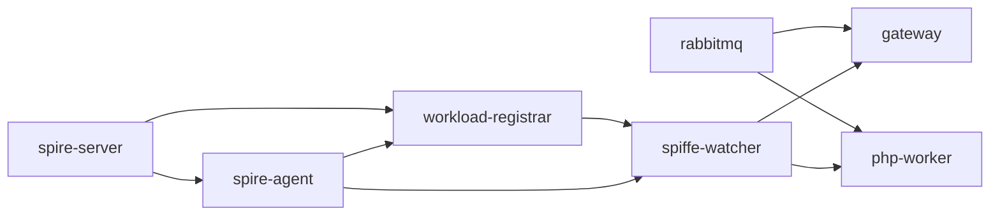

# 4.6 韌性設計（Resilience Design）

分散式系統於真實運行環境中，必然面臨網路閃斷、行程崩潰、憑證過期、相依服務重啟等情境。本系統之韌性設計目標並非追求絕對無故障（fault-free），而是確保於任一組件異常時，**零信任安全屬性不因此被削弱**，且整體服務能於有限時間內自動回復。

本研究所實作之韌性機制橫跨七個層級，自最外層之容器編排至最內層之交易補償，形成縱深防禦（defense-in-depth）之結構。本節先以 4.6.1 描繪整體層級關係，再於 4.6.2 至 4.6.8 依序說明各層之具體實作，並於 4.6.9 以對照表總結，最後於 4.6.10 誠實指出尚待改進之缺口。

---

## 4.6.1 韌性層級總覽

```mermaid
flowchart TB
    subgraph L1["L1 容器層 (Docker)"]
        HC[Healthcheck]
        DEP[depends_on: service_healthy]
    end
    subgraph L2["L2 註冊層 (Workload Registrar)"]
        REG[持續註冊迴圈 60s]
        SIG[/tmp/registrar-ready 訊號]
    end
    subgraph L3["L3 身份層 (SPIRE Workload API)"]
        SM[X509Source 狀態機]
        EB[指數退避重連]
    end
    subgraph L4["L4 記憶體層 (SHM Seqlock)"]
        SL[奇偶版本號協議]
        ROT[500ms 熱輪換]
    end
    subgraph L5["L5 應用層 (LSVID / JTI 快取)"]
        FC[Worker Fail-Closed]
        RH[Gateway 503 retry-hint]
    end
    subgraph L6["L6 訊息層 (AMQP)"]
        TO[Timeout 永續迴圈]
        CR[訊息分類 ack / nack / reject]
    end
    subgraph L7["L7 交易層 (Saga)"]
        COMP[補償事件]
    end

    L1 --> L2 --> L3 --> L4 --> L5
    L5 --> L6 --> L7
```

**圖 4.6-1 七層韌性機制分佈**

相較於典型 Service Mesh 架構（如 Istio）將身份、重試、熔斷邏輯集中於 Sidecar Proxy，本系統採「**無 Sidecar、應用層直接整合**」之設計。此取捨之代價為各應用須內嵌 SPIFFE 客戶端與 LSVID 驗證器，但換得以下優勢：

1. 無需額外代理之網路跳轉，LSVID 驗證直接於應用行程完成，降低延遲。
2. 補償交易（Saga）、JTI 重放快取等業務語意可與身份驗證共享執行脈絡。
3. 部署拓撲簡化：每台 Docker 僅需 SPIRE Agent + 應用 + spiffe-watcher 即可運行。

---

## 4.6.2 容器層：Healthcheck 與啟動編排

Docker Compose 以 `healthcheck` 與 `depends_on.condition: service_healthy` 建構出嚴格的啟動時序鏈。下表整理本系統主要服務之健康檢查配置：

| 服務 | interval | retries | start_period | 檢查方式 |
|---|---|---|---|---|
| `rabbitmq` | 5s | 20 | — | AMQP / TCP 連線 |
| `spire-server` | 5s | 30 | 10s | gRPC health check |
| `spire-agent` | 5s | 30 | 15s | Agent socket API |
| `workload-registrar` | 3s | 40 | 5s | `/tmp/registrar-ready` 檔案 |
| `spiffe-watcher` | 5s | 20 | 15s | `meta.json.x509_state == "ready"` |

**表 4.6-1 服務健康檢查矩陣**

依賴鏈如圖 4.6-2 所示，上游服務若未進入 `healthy` 狀態，下游容器不會啟動，避免了「應用行程已起但相依服務尚未就緒」之常見競態條件。



**圖 4.6-2 service_healthy 啟動相依鏈**

於 `docker-compose.yml` 中，Gateway 與 Worker 均聲明 `depends_on` 條件為 `rabbitmq`、`spire-agent`、`eventstoredb`、`spiffe-watcher` 四者皆 `service_healthy`。

---

## 4.6.3 身份層：SPIRE Workload API 連線韌性

系統與 SPIRE Agent 之連線基於長生命週期之 gRPC 雙向串流（`FetchX509SVID`、`FetchJWTBundles`）。當 Agent 重啟、socket 暫斷、或憑證輪換觸發串流結束時，`X509Source` 與 `JwtSource` 必須能自動重連並恢復憑證訂閱。

本研究於 `src/Spiffe/Source/X509Source.php` 實作五狀態之狀態機：

```
Idle ──start()──▶ Initializing ──first response──▶ Ready
                       ▲                               │
                       │                               ▼
                       └──── handleError() ──── Rotating ◀──── new response
                                                       │
                                                       ▼
                                                     Error ──max retries──▶ Closed
```

**圖 4.6-3 X509Source 生命週期狀態機**

重連策略採指數退避，核心演算法定義於 `src/Spiffe/Source/SourceConfig.php:108-112`：

```php
public function backoffDelay(int $attempt): float
{
    $delay = $this->initialBackoff * (2 ** ($attempt - 1));
    return min($delay, $this->maxBackoff);
}
```

此退避邏輯被 `src/Spiffe/Source/X509Source.php:317-333` 之主迴圈引用：每次串流終止後遞增 `consecutiveErrors`，若未超出 `maxRetries` 上限則計算退避時間並重新進入 `Initializing` 狀態。

下表列出可由環境變數覆寫之參數：

| 環境變數 | 預設值 | 意義 |
|---|---|---|
| `SPIFFE_MAX_RETRIES` | `0`（不限） | 最大連續重試次數 |
| `SPIFFE_BACKOFF_INITIAL` | `1` 秒 | 初始退避時間 |
| `SPIFFE_BACKOFF_MAX` | `30` 秒 | 退避時間上限 |
| `SPIFFE_CONNECT_TIMEOUT` | `5` 秒 | gRPC 連線超時 |

**表 4.6-2 Workload API 重連參數**

將 `maxRetries` 預設為不限並搭配 30 秒上限，是基於一項觀察：SPIRE Agent 之重啟時間通常在秒級至數十秒內，永久性失敗極為罕見；與其於短暫中斷後宣告失敗，不如持續嘗試至 Agent 恢復。

---

## 4.6.4 記憶體層：SHM Seqlock 崩潰復原

為降低每個應用行程皆建立 gRPC 串流之開銷，本研究將 SVID 透過共享記憶體（SHM）在 `spiffe-watcher`、Gateway、Worker 三類行程間共享。此設計要求於**寫入者可能崩潰**之前提下，讀取者仍能偵測並處理不一致狀態。

本研究採 Linux Kernel 之 seqlock 協議為理論基礎，於 `src/Spiffe/SharedMemory/SpiffeTableReader.php:269-290` 實作一致性讀取：

```php
for ($spin = 0; $spin < self::MAX_SPIN; $spin++) {
    $v1 = $this->readMetaRaw()['version'] ?? 0;
    if ($v1 & 1) {                       // 奇數版本：寫入中
        usleep(self::SPIN_SLEEP_US);
        continue;
    }
    $result = $readFn();
    $v2 = $this->readMetaRaw()['version'] ?? 0;
    if ($v1 === $v2) {                   // 讀取期間版本未變
        return $result;
    }
    usleep(self::SPIN_SLEEP_US);
}
return null;
```

其中 `MAX_SPIN = 200`、`SPIN_SLEEP_US = 500`（檔案行號 `:21-22`），意即讀取器最多自旋 200 次、每次 500 微秒，總等待上限 100 毫秒；若超過此時間仍無法取得一致快照，則回傳 `null` 並交由上層決定備援行為。

寫入者崩潰之偵測則由 `isStale()` 方法承擔（`:141-145`）：

```php
public function isStale(int $maxAgeSeconds): bool
{
    $elapsed = $this->secondsSinceLastUpdate();
    return $elapsed < 0 || $elapsed > $maxAgeSeconds;
}
```

Gateway 與 Worker 於啟動階段會呼叫 `awaitReady()`（`:186-204`）以 10 毫秒輪詢等待 SHM 進入可用狀態，預設逾時 30 秒（`SPIFFE_AWAIT_TIMEOUT`），逾時即拋出包含 `x509_state`、`jwt_state`、`error` 三欄之診斷錯誤，確保啟動失敗時開發者能快速定位根因。

---

## 4.6.5 身份熱輪換與 LSVID 錯誤處理

SPIRE 預設 SVID TTL 為 1 小時，每 15 分鐘即觸發輪換。為確保 Gateway 與 Worker 始終使用最新憑證簽署 LSVID，本研究於兩者啟動時各派生一條**協程監控迴圈**（coroutine watcher），呼叫 `SpiffeTableReader::watchVersion()`（`:157-178`）。

該方法以 500 毫秒為預設輪詢間隔，比對 `meta.json.version` 是否進階；一旦偵測到版本提升，即透過 `onChange` 回呼通知 Gateway 以新的 X.509 私鑰重建 `LSVIDSigner`。因重建過程僅涉及記憶體物件替換，整體達成**零停機之熱輪換**。

於例外處理層面，本系統對 LSVID 驗證失敗採分層回應策略：

- **Gateway 接入點**：若 LSVID 鑄造階段拋出 `LSVIDException`（通常因憑證已過期或 SHM 未就緒），Gateway 回傳 HTTP 503 並附上 retry hint，讓客戶端於短暫延遲後重試，而非暴露內部錯誤訊息。
- **Worker 啟動檢查**：Worker 於啟動階段直接讀取 SHM 進行健全性檢查，若主 SVID 為空或 SHM 過期且 `LSVID_REQUIRED=1`，則直接 `exit(1)` 由容器編排重啟，遵循 fail-closed 原則。
- **Worker 執行期監控**：Worker 另以協程每 30 秒檢查一次 SHM 過期狀態（閾值預設為 2×TTL = 7200 秒），逾時即記錄 ERROR 等級日誌。

此外，Worker 實例化三個職責獨立之 `LSVIDValidator`（參見 `bin/worker.php`）：

| Validator | 用途 | JTI 快取 |
|---|---|---|
| `$requestValidator` | 驗證來自 Gateway 之 L0 請求 | 啟用 |
| `$eventValidator` | 驗證 Saga 內部事件 L1 | 啟用 |
| `$filterValidator` | 供 SpiffeLsvidFilter 於下游呼叫重新驗證 | **停用** |

**表 4.6-3 三層 LSVID 驗證器配置**

三者分離之關鍵動機為：`SpiffeLsvidFilter` 會於同一請求生命週期內多次觸發 LSVID 驗證（每個下游呼叫一次），若共用同一 JTI 快取將導致第二次驗證被誤判為重放攻擊。

---

## 4.6.6 訊息層：AMQP 連線與消費者韌性

RabbitMQ 連線可能因多種原因中斷：網路抖動、broker 重啟、心跳逾時等。本系統於 `src/MessageQueue/Consumer.php:50-59` 之主迴圈中以寬鬆策略保持消費者存活：

```php
public function run(): void
{
    while ($this->channel->is_consuming()) {
        try {
            $this->channel->wait(null, false, 5);
        } catch (AMQPTimeoutException) {
            // Keep the consumer alive while waiting for the next message.
        }
    }
}
```

每次 `wait()` 以 5 秒為超時窗口，逾時僅為正常之「目前無訊息」狀態而非錯誤；此設計令消費者永不因短暫無訊息而退出。

針對訊息處理本身之錯誤，`Consumer::subscribe()`（`:29-47`）採三分類之處理策略：

| 錯誤類型 | 處理方式 | 語意 |
|---|---|---|
| 正常完成 | `message->ack()` | 佇列移除訊息 |
| `UnrecoverableMessageException` | `message->reject(false)` | 不可修復（如 schema 不符），丟棄 |
| 其他 `Throwable` | `message->nack(false, true)` | 可能暫時性錯誤，重新入列 |

**表 4.6-4 訊息處理結果分類**

此三分類策略確保**永久性錯誤不會進入無盡重試迴圈**，同時暫時性錯誤（如下游 HTTP 503）能透過 RabbitMQ 之 redelivery 自動再次嘗試。

連線層面，`src/MessageQueue/RabbitMQConnection.php:25-51` 實作了認證 fallback：若首次連線遭遇 `ACCESS_REFUSED`（常發生於容器初次啟動、帳號尚未建立完成時），則自動嘗試預設之 `zt / ztpass` 憑證，提升了本地開發與 CI 環境之體驗。

---

## 4.6.7 交易層：Saga 補償機制

Saga 模式（Garcia-Molina & Salem, 1987）以補償交易取代跨服務之強一致性鎖定。本研究於 `src/Saga.php:47-50` 定義 `compensate()` 為抽象基底方法：

```php
protected function compensate(string $rollbackEventClass, array $payload): void
{
    $this->eventBus->publish($rollbackEventClass, $payload);
}
```

具體之訂單交易 Saga（`Sagas/OrderSaga.php`）則於每一步驟之服務回應處檢查 `isSuccess()`（定義於 `src/Saga.php:72-75`，判準為回應中 `code === '200'`）；若失敗則發佈對應之補償事件：

| 原事件 | 失敗後發佈之補償事件 | 補償動作 |
|---|---|---|
| `InventoryDeductedEvent`（扣庫存失敗） | `RollbackOrderEvent` | 取消訂單 |
| `PaymentProcessedEvent`（扣款失敗） | `RollbackInventoryEvent` | 回滾庫存 → 取消訂單 |
| `OrderSagaCompletedEvent`（確認失敗） | `RefundEvent` → `RollbackInventoryEvent` → `RollbackOrderEvent` | 反序補償 |

**表 4.6-5 OrderSaga 補償對照**

與兩階段提交（2PC）相比，Saga 模式之顯著優勢為：

1. **無分散式鎖**：各服務之本地交易獨立提交，不會因協調者故障而阻塞。
2. **最終一致性**：接受短暫之中間狀態（例如「已扣庫存但尚未扣款」），以補償事件於失敗後恢復。
3. **與事件驅動架構天然契合**：補償本身即為一個事件，無需額外之協調協定。

---

## 4.6.8 註冊層：Workload-Registrar Sidecar

SPIRE Server 之 workload entry 必須於 Agent 完成 attestation 後始能註冊；然而，若註冊時機早於 Agent 就緒、或 SPIRE Server 重啟後 entry 遺失，整個信任鏈將斷裂。本研究導入獨立之 `workload-registrar` 容器（Dockerfile 位於 `docker/workload-registrar/Dockerfile`）以解決此問題。

其核心邏輯位於 `spiffe/scripts/register-workloads-internal.sh`：

1. 啟動後先輪詢 SPIRE Server 健康狀態直至成功。
2. 以 `spire-server agent list` 確認 Agent 已完成 attestation。
3. 執行五筆 workload 註冊（`php-gateway`、`php-worker`、`order-service`、`production-service`、`user-service`）。
4. 建立 `/tmp/registrar-ready` 空檔案，作為 healthcheck 之就緒訊號。
5. 以 `REGISTER_INTERVAL`（預設 60 秒）為週期，持續重入步驟 3，確保 SPIRE Server 意外重啟後 entry 能自動復原。

此 sidecar 透過 volume `/tmp/spire-server/private` 直接與 SPIRE Server 共用其私有 UDS socket，免去跨容器網路呼叫並提升安全性（Server API 不需對外開放）。

---

## 4.6.9 韌性機制完整對照表

| # | 層級 | 元件 | 觸發條件 | 行為 | 位置 |
|---|---|---|---|---|---|
| 1 | L1 容器 | rabbitmq healthcheck | AMQP ping 失敗 | 編排器標記 unhealthy | `docker-compose.yml` |
| 2 | L1 容器 | spire-server healthcheck | gRPC 失敗 | 阻擋 Agent / Registrar 啟動 | 同上 |
| 3 | L1 容器 | spire-agent healthcheck | socket 無回應 | 阻擋 Watcher 啟動 | 同上 |
| 4 | L1 容器 | workload-registrar healthcheck | `/tmp/registrar-ready` 不存在 | 阻擋 Gateway/Worker 啟動 | 同上 |
| 5 | L1 容器 | spiffe-watcher healthcheck | SHM 未就緒 | 阻擋 Gateway/Worker 啟動 | 同上 |
| 6 | L1 容器 | depends_on 相依鏈 | 上游 unhealthy | 本身不啟動 | 同上 |
| 7 | L2 註冊 | registrar loop | 週期 60s | 重新註冊五筆 workload | `spiffe/scripts/register-workloads-internal.sh` |
| 8 | L3 身份 | X509Source 狀態機 | 串流錯誤/結束 | 退避後重連 | `src/Spiffe/Source/X509Source.php:317-333` |
| 9 | L3 身份 | JwtSource 狀態機 | 同上 | 同上 | `src/Spiffe/Source/JwtSource.php` |
| 10 | L3 身份 | 指數退避 | 每次重連 | `min(init × 2^N, max)` | `src/Spiffe/Source/SourceConfig.php:108-112` |
| 11 | L4 記憶體 | Seqlock consistentRead | 寫入者同時更新 | 200 × 500µs 自旋 | `src/Spiffe/SharedMemory/SpiffeTableReader.php:269-290` |
| 12 | L4 記憶體 | isStale 監控 | updated_at 逾 2×TTL | 告警 | `:141-145` |
| 13 | L4 記憶體 | awaitReady | 啟動等待 | 10ms 輪詢，30s 逾時 | `:186-204` |
| 14 | L4 記憶體 | 熱輪換 watchVersion | meta.json.version 進階 | 重建 LSVIDSigner | `:157-178` |
| 15 | L5 應用 | Gateway LSVIDException | 憑證過期/SHM 未就緒 | 503 + retry hint | `bin/gateway.php` |
| 16 | L5 應用 | Worker SHM 檢查 | 主 SVID 空 | fail-closed exit(1) | `bin/worker.php` |
| 17 | L5 應用 | Worker staleness 監控 | 逾 2×TTL | ERROR 日誌 | 同上 |
| 18 | L5 應用 | JTI 重放快取 | 重複 jti | 拒絕 | 同上 |
| 19 | L6 訊息 | AMQP wait 迴圈 | timeout | 忽略繼續 | `src/MessageQueue/Consumer.php:50-59` |
| 20 | L6 訊息 | 訊息三分類 | 處理器例外 | ack / nack / reject | `:29-47` |
| 21 | L6 訊息 | 認證 fallback | ACCESS_REFUSED | 嘗試預設帳號 | `src/MessageQueue/RabbitMQConnection.php:25-51` |
| 22 | L7 交易 | Saga compensate() | 步驟失敗 | 發佈補償事件 | `src/Saga.php:47-50` |
| 23 | L7 交易 | OrderSaga 補償鏈 | 扣款/庫存失敗 | 退款 → 回滾庫存 → 取消訂單 | `Sagas/OrderSaga.php` |

**表 4.6-6 系統韌性機制總表**

---

## 4.6.10 本節小結

本節系統性地整理了橫跨七個層級、共 23 項韌性機制之設計與實作。相較於主流 Service Mesh 方案（如 Istio）將大部分韌性邏輯集中於 Sidecar Proxy，本研究以「無 Sidecar、應用層直接整合」之路線，證明於 PHP/OpenSwoole 生態下仍可達成完整之零信任韌性屬性，且換得更低之網路跳轉延遲與更直接的業務邏輯整合。

縱向觀之，七個層級彼此形成縱深防禦：容器層保證啟動時序、註冊層保證信任域完整、身份層保證憑證可取得、記憶體層保證讀取一致、應用層保證錯誤不外洩、訊息層保證非同步可靠、交易層保證業務最終一致。任一層之失敗均由上下層合力吸收，而非演變為系統性故障。

**已識別之改進空間**：

1. **容器重啟政策缺失**：`docker-compose.yml` 目前尚未統一設定 `restart: unless-stopped`，意即 Gateway/Worker 因未預期錯誤 `exit(1)` 後將永久停止，須仰賴上層編排器（Kubernetes、Swarm）補足。後續將補上此設定以於單機 Compose 環境下亦具備自動復原能力。
2. **Saga 失敗路徑無 DLQ 重播**：目前補償事件若自身失敗（例如退款 API 亦不可達），僅記錄日誌而無二次重試或 dead-letter queue 策略。此缺口可能導致少數交易停留於部分補償狀態。建議未來引入持久化 Saga 狀態機（如 Camunda、Temporal），以支援長時間之補償重試。
3. **SHM 寫入者崩潰後之自癒**：目前若 `spiffe-watcher` 行程崩潰，SHM 將進入過期狀態並由應用端告警，但無自動重啟之協同機制。建議於容器層補上 `restart: always` 並評估導入 systemd / supervisord 之可行性。

上述缺口皆為實作層之工程任務而非設計層之根本限制，並不影響本研究所提出之七層縱深韌性模型之成立。

---

## 代碼引用索引

本節內所有 `檔案路徑:行號` 格式之引用，讀者可至專案根目錄以文字編輯器或 `less +<行號>` 直接開啟對應位置驗證。主要引用檔案清單如下：

- `docker-compose.yml`
- `src/Spiffe/Source/X509Source.php`
- `src/Spiffe/Source/SourceConfig.php`
- `src/Spiffe/SharedMemory/SpiffeTableReader.php`
- `src/MessageQueue/Consumer.php`
- `src/MessageQueue/RabbitMQConnection.php`
- `src/Saga.php`
- `Sagas/OrderSaga.php`
- `bin/gateway.php`
- `bin/worker.php`
- `spiffe/scripts/register-workloads-internal.sh`
- `docker/workload-registrar/Dockerfile`
